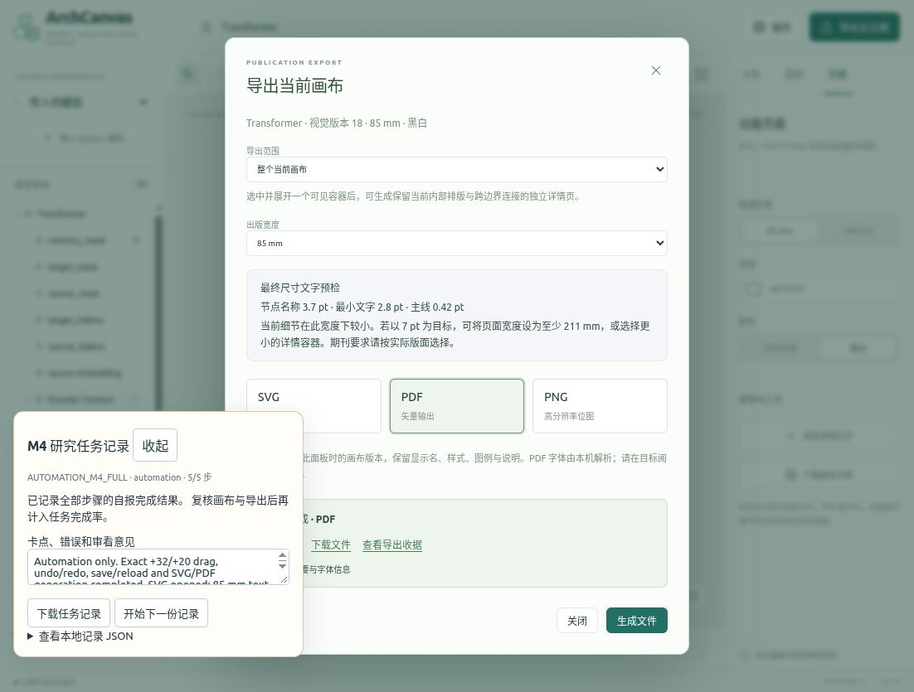

# 当前构建的完整 Transformer 自动化任务

同一 pristine 文档已通过普通 Studio UI 完成五步操作并收集实际工件。它补充工程任务覆盖，**严格字段/几何审计仍为 failed，M4 未完成**。真人研究者为 0；全部记录明确为 `AUTOMATION_M4_FULL` / `automation`，未填写真人 review 或出版通过。

正式实现、App/core/dist、原39矩阵及五个真人席位冻结未改。任务使用独立 `.archcanvas/m4-full-task-automation-final` 的 S01，loopback8876；prepare工具要求3–5席，因此S02/S03保持空白。参见[准备记录](preparation/README.md)、[收集收据](collect-receipt.json)、[收集字节复核](collector-audit.json)与[独立字段审计](independent-field-audit.json)。

## 实际任务与时序

[原始公开 Study JSON](collection/incoming/study.json)从可见只读文本框原样保存，没有读取隐藏sessionStorage或重写checkpoint。先展开Encoder/第一层并定位self attention，再编辑alias/fill、legend/annotation与页面；记录checkpoint2之后，才追加FFN展开、pin与edge18样式。之后实际拖动、undo/redo、保存、同tab刷新重开、生成并打开导出。最后checkpoint5记录的是当时PDF结果链接；先前SVG链接另及时保存，两种工件均收集。

五步是自报完成，末checkpoint累计1,230,519ms；ISO时间差/collector为1,230,520ms（1ms精度差），含代理等待和重开，不是input-to-paint或180秒真人成功。[预声明字段计划](expected-plan.json)使用冻结baseline身份与父代理事先指定的编辑意图，文件在部分UI动作之后写入；不声称文件时间戳先于全部输入。说明创建前要求的viewBox没有现场采到，因此该位置公式保留未知。

最终文档revision18，sourceDigest `01ac6cd61f058e9de5230b0c371527a1fa2b4f73842019e0e5785d5f0deb0916`，irDigest `b0bd5bf01fa364bf415f6aba9707f5d74d9b7bb058534c0dac54fc48fd3729e6`。别名`Encoder Context`、fill override `#deeee6`、`Residual route`图例、说明文字、edge18 width2/dashed、85mm/monochrome/white、固定memory_mask及FFN前沿都保留在保存文档和两导出输入中。黑白显示白填充，保存的绿色override仍存在；[实际彩色DOM](collection/incoming/color-style-DOM.json)与[截图](collection/incoming/color-style-after-FFN.jpg)来自FFN已展开后的临时paper切换，随后恢复monochrome，不冒充首次切换前的截图。

## 几何、历史与未通过项

真实CUA drag `[650,311] → [682,331]`，前置DOM相机精确scale1，目标expand从canvas `(170,996)`到`(202,1016)`，符合事先指定的+32/+20。一次undo恢复前置canvas，一次redo恢复移动后canvas；Save/reload保留完整Canvas，刷新后历史栈为空且相机fit，不宣称相机或历史持久化。

严格“所有其它canonical body/path不变”的预期没有通过。目标与祖先原点保持；四个相关祖先宽度都增加32，三个非直接目标incident路径edge6/7/16随之变化。此表是实际观察，不是修改后的成功oracle：

| 对象 | before / undo宽 | after / redo / reopened宽 |
| --- | ---: | ---: |
| Transformer | 670 | 702 |
| Encoder | 374 | 406 |
| EncoderLayer 1 | 314 | 346 |
| feedforward | 254 | 286 |

before/after canvas viewport为`x230,y115,w783,h526`，undo/redo为`x200,y115,w672,h641`。CSS camera保持相同translate/scale，但所有screen rect因viewport变化而不满足严格比较；原因未认证。Study environment记1280×720/DPR1，最终公开DOM记1102×835/DPR1；这不是固定viewport的屏幕连续性证据。固定memory_mask canvas不动，100%focused时offscreen，屏幕保护未知。任务未附加input observer，没有完整trusted down/move/up raw；CUA动作与DOM几何不能认证原生延迟或连续paint。

## 实际导出与观察

[SVG](collection/collected/exports/77de76b8a527438c83c0348e8b22ad4a/figure.svg)及[PDF](collection/collected/exports/764e8fd549874a8a8f6fc702038ec0e0/figure.pdf)均是revision18的整个当前画布、85mm宽、约187.75822mm高。collector精确核对normalized SVG重建字节；PDF仅本地receipt一致性，未独立重跑converter。

实际SVG文件URL已打开，[打开截图](collection/incoming/export-open.jpg)和[公开XML DOM](collection/incoming/SVG-open-DOM.json)保留标签、图例、说明、source facts/port bindings与物理尺寸。可见文字很小，面板预检为节点名约3.7pt、最小文字约2.8pt；说明横跨Add/残差区。该图没有取得出版可读性通过。PDF URL也真实打开，但[页面一直为空白](collection/incoming/PDF-open-blank.jpg)，浏览器字体/文字与连接审看未知；不因有PDF bytes宣称已审看。

独立校验器的失败和unknown、实际raw/screenshot/收集bytes均保留；不改预期迎合结果、不修改自报时间、不把自动化加入研究者分母。后续应处理可读性/说明位置和空间变化，固定环境再测屏幕与原生性能；39图独立人工审看与3–5真实使用者继续待完成。

## 独立工具验证与复核

[校验器](../../../scripts/validate_automation_task.py)只用Python标准库，不导入产品或用产品结果推导移动预期。[11项反例](../../../tests/test_automation_task_audit.py)与[实际运行日志](independent-tool-tests.txt)覆盖错delta/target、viewport漂移、祖先增宽不得改oracle、源码port篡改、黑白显示丢失saved override、UUID/legend、同revision不同export input、改SVG并重写receipt、缺证据保留unknown和拒绝output覆盖raw。这11项是新工具测试，不累加到历史Python219/Studio54，也不把真实任务审计变为passed。

实际字段报告是1025 pass /70 fail /11 unknown；这些是重复逐对象谓词，不是1106个产品测试。[复核参数](audit-command.json)使用公开原字节副本、输出新`/tmp`报告。完整审计预期退出码1，因为严格失败仍存在；missing evidence与人工认证继续单列。清单由[manifest](manifest.json)绑定本目录工件与工具，不自绑定自身，也不证明截图捕获时间或人工身份。
