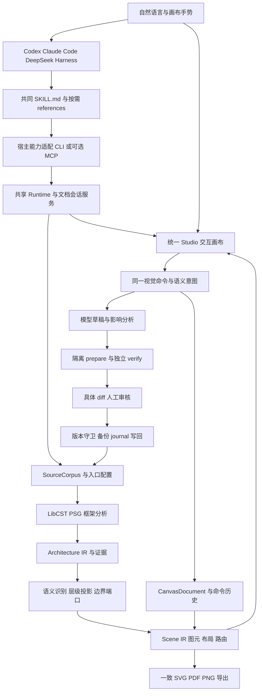
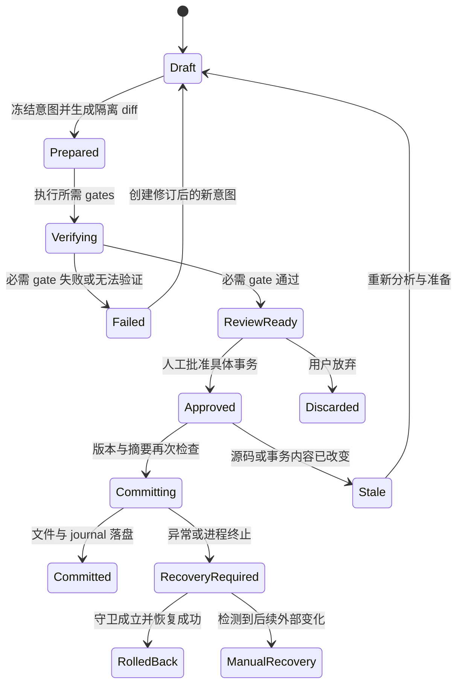

# ArchCanvas：跨 Harness 模型视觉工作台 Skill 与双向编辑框架技术计划书

> 调研日期：2026-10-04（Asia/Shanghai）  
> 文档性质：基于本地源码与公开技术文档的架构设计、分模块实施计划；不是已完成功能的声明。  
> 实现约束：用户已确认 `ArchCanvas_Model Architecture Studio_Temp` 是失败版本；正式工程默认从头编写，旧版仅作低可信历史参考，小范围代码只有取得独立证据后才可采用。  
> 产品定位：面向 Codex、Claude Code 与官方 DeepSeek Harness 的模型视觉工作台 Skill；视觉效果与直接交互是核心卖点，共享 runtime/Studio 提供实现。  
> 目标：一句话打开论文式模型图 → 在同一画布展开、改图元与图例、调整布局 → 保存与一致导出；需要改变模型时再进入验证、审核与源码写回。
> 首批代码进展（2026-10-04）：正式目录已从头建立静态 AST 前端、CLI/本地文档服务、React Studio、CanvasDocument/视觉历史、Scene/SVG、三个独立源码样例与验收脚本；当前为视觉 Alpha，尚无源码写回、运行观察或 PNG/PDF。实际范围与证据见 [正式工程 README](ArchCanvas_Model_Architecture_Studio/README.md) 和 [验收记录](ArchCanvas_Model_Architecture_Studio/docs/acceptance.md)。

阅读建议：先看 §0–4 的定位、调研与产品分层，再看 §8–9、§13 的视觉与交互合同，§15 的跨 Harness Skill 交付；§5–7、§10–12、§14 保留源码与双向编辑的技术依据，§16–18 描述从头实现、有限参考门槛、视觉优先路线与验收。§22 给出源码及官方宿主资料。

## 0. 核心结论与推荐路线

建议将 ArchCanvas 定义为**跨 Harness 的模型论文制图与交互编辑 Skill**。用户在 Codex、Claude Code 或官方 DeepSeek Harness 中用自然语言发起任务，Skill 调用共享 runtime，将真实源码转为漂亮且可持续编辑的模型图，并打开统一 Studio。**画布视觉质量、层级展开的空间连续性、图元/图例的直接修改，以及屏幕与论文导出的体验，是产品第一优先级。** 源码恢复与审核写回是这项体验的事实基础和必要支撑。

它需要三层交付，不能仅靠一份提示词完成：

| 交付层 | 用户价值 | 实现职责 |
|---|---|---|
| Portable Skill | 在既有 coding harness 中一句话进入制图/编辑流程 | 意图路由、模型入口发现、风格选择、工具编排、打开画布、结果说明 |
| Shared Runtime | 确定且可验证地分析、布局、保存、导出与写回 | Python/TypeScript 协议、CLI、可选 MCP、文档服务、任务与事务 |
| Interactive Studio | 可以直接操作且适合论文的模型画布 | SVG 场景、图元/图例/连线编辑、原位展开、历史、源码和审查视图 |

首期演示的主线应是：**打开真实 Transformer 的论文式总览 → 展开 Encoder/Attention → 改显示名、颜色和图例 → 拖动与对齐 → 撤销 → 保存并导出**。之后再展示修改 dropout、查看图上影响与最小 diff、批准后写回、重分析后保留排版。默认画布服务制图，审查在确实需要改变源码时出现。

关键判断如下：

1. **同一 Skill 核心、同一文档、同一 renderer。** 三种宿主只适配发现路径、调用工具、展示方式和权限；不维护三套画布。直接手势和自然语言视觉修改落在同一 VisualPatch/命令历史中。
2. **视觉第一屏必须作为早期硬出口。** 一张正确但拥挤的算子图不能体现卖点；首阶段就验证纸面版式、留白、图元、残差/memory 路由与对象级编辑。图例不是最后补的 footer。
3. **论文抽象与视觉风格独立。** Encoder/Decoder、重复层、Attention、FFN 和残差需要真实结构识别；色板、字体、图元和页宽是可切换的视觉资产。预设不得补出源码不存在的模块。
4. **源码解析、模型语义、论文抽象、画布布局和源码改写分层。** `nodes/edges` JSON 无法同时承担这些职责；CanvasDocument 保存用户呈现，Architecture IR 保存真实事实。
5. **视觉修改轻量，模型修改有审核。** 改颜色、显示别名、图例、注释、走线立即预览、保存与撤销；改参数或计算连接才形成语义草稿与 prepare → verify → review → commit 事务。
6. **可查看、可展开、可编辑、可写回分别声明。** 任意 Python 尽力查看与可靠双向子集分开；未知保留为 opaque 区域。不能因为能显示就承诺能执行或能改写。
7. **正式工程默认从头实现。** 用户已确认临时版失败，因此它不构成新版本的底座、默认运行入口或迁移对象。协议、分析前端、场景、交互与事务按新合同独立编写；旧版用于理解失败模式，只有取得独立正确性证据的少量代码才可作为候选。成熟且许可清晰的第三方库仍可正常依赖。

推荐技术主线：

- Skill：精简通用 `SKILL.md` + 按需 references；Codex 可附 `agents/openai.yaml`，不把宿主专用字段放进共同入口。官方 DeepSeek Harness 的能力与发现路径按 §15 和官方源码确认。
- Runtime：Python 3.11、LibCST、Pydantic v2；本地文档/任务服务；CLI 是共同基线，可选 MCP 调用相同业务函数。
- Studio：React + TypeScript + 自有类型化 SVG 场景；ELK.js Worker、文字测量、局部约束布局；CodeMirror 6 按需显示源码/diff。
- 视觉资产：版本化 design tokens、glyph registry、paper presets、golden figures；一个 Scene IR 同时服务屏幕与 SVG/PDF/PNG。
- 双向基础：SourceCorpus、PSG、Architecture IR、Semantic Overlay、View Projection、CanvasDocument、ChangeIntent、SourceTransaction。
- 可选：FX/`torch.export`/hooks 的隔离观察；MCP 与 Tauri 均不作为首屏体验的前置条件。

首期聚焦 PyTorch 与 Transformer/MLP/Residual CNN 的真实源码子集，先让研究者能完成制图，再扩展模型家族。新增结构 lowering 的范围应受视觉工作台交付节奏约束，不能让通用程序分析研究长期阻塞可试用产品。

## 1. 调研范围、方法与证据等级

### 1.1 本次实际查看的内容

对 `Source_Code_Project` 的 8 个仓库读取了 README、依赖声明、许可证文件及与本目标相关的核心源码。重点查看解析入口、图表示、节点/端口、代码生成、shape 推导、层级、布局、运行追踪、科研图编辑和写回验证链路。

额外抽查了工作区中的：

- `ArchCanvas_Model Architecture Studio_Temp/`：只读查看其协议、分析、出版、画布和事务路径，以识别失败模式。用户已确认它是失败版本；此前看到的类型/函数/README 声明不构成可用性证据，更不构成迁入正式工程的建议。
- `Constraint relationship of architecture diagram/` 中的 V7 逆向抽象指南，尤其是整体嵌套图、变量流、多输入输出、图元类型和未知事实的表达原则。

联网核实了 PyTorch FX 官方文档、ELK 图数据结构和 Transformer 论文摘要；PyTorch export 最终页面返回 HTTP 403，其链接和未核实范围单列于参考资料。调研没有运行用户模型、安装这 8 个项目、启动其服务或执行其完整测试。因此下文的“已存在实现”指源码中可见的实现，“可靠/可用”仍需后续针对性验收。

### 1.2 本地仓库版本锁定

以下为本地 checkout 的 HEAD；最后提交日期只描述该 checkout，不代表线上仓库的最新状态，也不等同于项目维护活跃度评估。

| 项目 | 本地 HEAD | 本地最后提交日期 | 定位 |
|---|---|---|---|
| LibCST | `d9a255843b5cdbecc6834684d233bce1f2987f9d` | 2026-08-10 | Python 保格式解析与改写 |
| Netron | `91dc366171a1248fa2965866c0e2660c6d560496` | 2026-10-03 | 序列化模型查看器 |
| DL-Playground | `c07a79b60bcb67be0bec2276002bd21f92a616de` | 2026-03-16 | 画布建模与 PyTorch 代码生成 |
| torchview | `241d22b5cdeb2c227acee2c85611f0442f15c091` | 2026-02-26 | PyTorch 运行图捕获 |
| Neural Network Playground | `c754d70fbd9562ee531c1c9bcf28b93964b57d5e` | 2026-07-12 | 浏览器 MLP 训练教学 |
| TensorFlow Playground | `02469bd3751764b20486015d4202b792af5362a6` | 2022-06-06 | TypeScript 神经网络教学 |
| TensorSpace.js | `eec8a46524fd3fb4c9f9fba804fa81d592637534` | 2021-11-09 | 3D 层结构与中间特征展示 |
| Tavotto | `85c4a93af802d491878b8c0eed4370e7e58e17d2` | 2026-10-04 | Matplotlib 科研图编辑 |

Tavotto 是浅克隆，不能依据其本地历史判断长期演化。文末提供仓库地址；源码论据以本表版本为准。

### 1.3 设计文档中的证据标签

- **源码事实**：本次在对应文件与函数中读到的行为。
- **文档声明**：README/ADR 的描述；尤其要区分 Proposed 与已实现。
- **设计建议**：本计划选择的方案，尚待实现与验证。
- **待审计**：发现可能影响目标的实现路径，需要测试才能判断实际后果。

## 2. 八个参考项目的用途、实现与适用边界

### 2.1 LibCST：源码保格式改写的基础设施

**用途与技术结构。** LibCST 解析 Python 具体语法树，保留注释、空白、括号、缩进与换行等信息。它提供不可变 CST 节点、visitor/transformer、metadata provider、matcher 和 codemod；仓库包含 Python 层与 Rust native parser。它不是深度学习模型分析器。

**关键源码。**

- [`libcst/_nodes/module.py`](Source_Code_Project/LibCST/libcst/_nodes/module.py)：`Module` 保存 encoding、default_indent、default_newline、has_trailing_newline；`code` / `code_for_node` 负责重新输出代码。
- [`libcst/_nodes/base.py`](Source_Code_Project/LibCST/libcst/_nodes/base.py)：`with_changes` 支持局部不可变更新。
- [`libcst/metadata/name_provider.py`](Source_Code_Project/LibCST/libcst/metadata/name_provider.py)：`QualifiedNameProvider` / `FullyQualifiedNameProvider` 解析名称来源；条件导入或遮蔽可产生多个候选，不能当成唯一类型证明。
- [`libcst/metadata/scope_provider.py`](Source_Code_Project/LibCST/libcst/metadata/scope_provider.py)、[`wrapper.py`](Source_Code_Project/LibCST/libcst/metadata/wrapper.py)：作用域与 metadata 包装；wrapper 默认克隆树，缓存不能跨不匹配的树身份误用。
- [`libcst/codemod/_visitor.py`](Source_Code_Project/LibCST/libcst/codemod/_visitor.py)：带上下文的 transformer/visitor 与 metadata 依赖管理。

**对本项目的意义。** 直接依赖 LibCST 实现 Python 编辑器后端：改构造参数、替换激活、插入已注册模块、改调用参数与局部变量使用。构造目标锚点时同时保存文件摘要、限定名、CST 路径、位置及语义指纹。

**边界。** CST 只说明代码的语法与部分名称关系。它不能自动证明 `forward` 的张量依赖、动态模块实例、shape、配置表达式或任意重连的语义正确性。需要在其上实现项目解析、有限抽象解释、框架契约与验证。不能把 `PositionProvider` 的行号当成永久身份。

**许可证。** 本地 LICENSE 声明贡献主要为 MIT；列出的派生 Python 文件有 PSF/双许可说明。使用发行依赖优先于复制内部 parser。

### 2.2 Netron：格式适配、模型检查与大图展示的参考

**用途与技术结构。** Netron 主要读取 ONNX、PyTorch 导出/序列化形式、TensorFlow、Keras 等模型文件，通过 JavaScript 格式适配器生成统一的模型展示对象，再由 SVG 图形层和布局器展示；提供浏览器、Electron 和 Python 启动形式。

**关键源码。**

- [`source/view.js`](Source_Code_Project/netron/source/view.js)：`ModelFactoryService` 从约 7241 行开始注册格式工厂，通过扩展名、内容签名和上下文匹配；`pushTarget` 支持进入不同 graph/target。
- [`source/onnx.js`](Source_Code_Project/netron/source/onnx.js)：`ModelFactory.match/open`、`Model`、`Graph`、`Node`、`Value`、`Argument`；保留输入输出、属性、initializer、子图等检查信息。
- [`source/pytorch.js`](Source_Code_Project/netron/source/pytorch.js)：分派不同 PyTorch 存储/导出形式，构建展示 graph；这不是一个通用 `.py` 项目逆向前端。
- [`source/grapher.js`](Source_Code_Project/netron/source/grapher.js)：SVG 节点/边与布局；`Graph.layout(worker)` 使用 Dagre 路径，支持 worker 与大图策略。

**可借鉴。** 格式适配器注册、属性/张量检查侧栏、延迟读取、大图布局任务取消、展示模型与文件读取分离。后期 ONNX 查看可以复用其对象设计；具体代码引入需固定版本并建立适配测试。

**边界。** 导出模型通常已经损失原类封装、循环、辅助函数、注释和配置来源；只有 state_dict/Safetensors 权重也不能唯一恢复 `forward`。Netron 的显示节点没有本计划要求的 Python CST 写回定位与人工审核事务，不能作为 Python 双向编辑主 IR。

**许可证。** MIT。建议作为查看器/适配器参考，不 fork 成主产品，以免把格式查看体系与源码事务体系耦合。

### 2.3 DL-Playground：最接近“画布 → 模型代码”的参考

**用途与技术结构。** React 19 + TypeScript + `@xyflow/react` 构建节点编辑器；节点类携带参数 schema、handles、shape 规则、初始化/forward 代码模板。FastAPI 服务调用 Docker worker，worker 中运行 PyTorch/TorchLens。前端使用 ELK/Dagre、Monaco，支持可复用模块、图导出和代码面板。

**关键链路。**

1. [`frontend/src/utils/graphIR.ts`](Source_Code_Project/DL-Playground/frontend/src/utils/graphIR.ts)：`buildGraphIR` / `applyGraphIR` 将 React Flow 状态转成版本 2 图；包含 node id、handle、parentId、position、data 与 edge。
2. [`utils/moduleRegistry.ts`](Source_Code_Project/DL-Playground/frontend/src/utils/moduleRegistry.ts)、[`stackNavigation.ts`](Source_Code_Project/DL-Playground/frontend/src/utils/stackNavigation.ts)：模块内部图、接口、版本、参数映射与模块编辑栈；持久化主要通过 localStorage。
3. [`utils/codeCompile.ts`](Source_Code_Project/DL-Playground/frontend/src/utils/codeCompile.ts)：`recursiveCodeGenerator` 排模块依赖，`compileGraphToScript` 对图拓扑排序，再调用节点的 `getInitCode/getForwardCode` 生成文本和 CodeSpan。
4. [`utils/shape_verifier.ts`](Source_Code_Project/DL-Playground/frontend/src/utils/shape_verifier.ts)：逐轮处理依赖已就绪节点，调用 layer registry 的 shape 规则。
5. [`utils/diagramProjector.ts`](Source_Code_Project/DL-Playground/frontend/src/utils/diagramProjector.ts)、[`diagramExport.ts`](Source_Code_Project/DL-Playground/frontend/src/utils/diagramExport.ts)：把 GraphIR 转成较简洁节点，再布局、拼接 SVG、转换 PNG。
6. [`backend/runner.py`](Source_Code_Project/DL-Playground/backend/runner.py)、[`worker.py`](Source_Code_Project/DL-Playground/backend/worker.py)：Docker tracing 请求与 TorchLens 调用；提供 code 时通过 `exec` 实例化模型，必须保持隔离运行。

**本次读到的具体限制。**

- GraphIR 混合了语义与位置，未形成带源码快照、CST 锚点、证据等级的原项目恢复链路。
- `codeCompile.ts` 的图排序未覆盖所有节点时，会把剩余节点追加到输出顺序；本产品应对普通计算环返回阻断诊断，循环要进入显式 Loop IR。
- `shape_verifier.ts` 主要按上游节点的 `defaultShape` 传播，虽然结果可保存 `byHandle`，输入读取没有完整按 edge 的 source/target port 绑定；对 LSTM、多输出 Attention 等不宜直接复用。
- `MultiheadAttentionNode.tsx` 将 K/V 与 Q 全 shape 相等作为检查，不能覆盖合法的不同 query/key 长度的 cross-attention；mask 规则也需按 PyTorch API 与 head 维度重新实现。
- worker 的无代码 `GraphModel` 给所有图节点创建 `MultiInputIdentity`，这只是连通关系 stub，不是层语义验证；不能把它成功执行当成真实网络正确。
- 多输入 tracing 的当前实现显式告警并只把第一个输入传入 TorchLens，因此不能验证 Encoder-Decoder 等真实多输入模型。
- CodeSpan 对生成的新文件有帮助，但不是对任意原文件进行逆向修改的 source map。

**可借鉴。** 节点参数 schema、命名端口、模块封装、拖拽交互、shape 提示、图与代码联动。新增模型的托管代码生成模式可以采用类似思想；导入已有源码的模式必须另建保格式修改器。

**许可证。** 本次在仓库根与前端依赖声明中未找到项目自身明确许可证。公开仓库不自动等于可复制代码。现阶段作为行为与设计参考；直接复用前先取得明确授权。

### 2.4 torchview：运行捕获、模块层级与 shape 证据

**用途与技术结构。** `draw_graph` 接收 PyTorch `nn.Module` 与输入，执行 forward，记录 tensor/module/function，然后生成 Graphviz 图。支持 depth、expand_nested、roll、隐藏内部 tensor/function 和 meta device 等选项。

**关键源码。**

- [`src/torchview/torchview.py`](Source_Code_Project/torchview/src/torchview/torchview.py)：输入处理、`forward_prop`、模式切换与 forward 执行。
- [`recorder_tensor.py`](Source_Code_Project/torchview/src/torchview/recorder_tensor.py)：`Recorder` 临时替换 `nn.Module.__call__` 与若干 tensor 创建函数；`RecorderTensor.__torch_function__` 捕获函数调用；模块 wrapper 维护深度、上下文和输入输出 shape。
- [`computation_graph.py`](Source_Code_Project/torchview/src/torchview/computation_graph.py)：维护运行节点层级，选择可见节点、rolling、cluster 与 Graphviz 输出。
- [`computation_node/`](Source_Code_Project/torchview/src/torchview/computation_node/)：ModuleNode、FunctionNode、TensorNode 等运行对象。

**可借鉴。** 模块调用与函数调用同时记录、tensor 显式对象、不同深度投影、共享/重复展示。可作为隔离 worker 内的可选观察器或验证对照。

**边界。** 它实际执行目标模型，一次 trace 只观察指定输入、模式和配置的路径；`device='meta'` 可以减少张量存储需求，但不意味着没有 Python 执行、所有算子都支持 meta、没有任何资源消耗。其全局替换机制不应与多会话服务同进程混用。Graphviz 是查看结果，不能反推出保留原格式的源码编辑。

**许可证。** MIT。推荐保持可选插件；不要让静态分析安装依赖 PyTorch/Graphviz 才能工作。

### 2.5 Neural Network Playground：教学交互与训练状态模型

**用途与技术结构。** React 19 + TypeScript + React Flow，浏览器内实现简单 MLP、梯度、损失与优化器。用户选择数据集、层数、神经元、激活和训练参数，观察权重、损失、准确率与决策边界。

**关键源码。**

- [`netlab/src/engine/network.ts`](Source_Code_Project/neural-network-playground/netlab/src/engine/network.ts)：MLP 的逐层 forward/backward，结合输出激活选择损失梯度。
- [`engine/layers.ts`](Source_Code_Project/neural-network-playground/netlab/src/engine/layers.ts)、[`matrix.ts`](Source_Code_Project/neural-network-playground/netlab/src/engine/matrix.ts)：Dense 层与矩阵运算。
- [`engine/trainingEngine.ts`](Source_Code_Project/neural-network-playground/netlab/src/engine/trainingEngine.ts)：session 初始化、step/runEpoch、重建网络、指标和预测网格。
- [`engine/optimizers.ts`](Source_Code_Project/neural-network-playground/netlab/src/engine/optimizers.ts)：SGD、Momentum、Adam 的状态与更新。
- [`context/EngineContext.tsx`](Source_Code_Project/neural-network-playground/netlab/src/context/EngineContext.tsx)、[`TrainingContext.tsx`](Source_Code_Project/neural-network-playground/netlab/src/context/TrainingContext.tsx)：消息形式的本地 dispatch、发布订阅、播放与训练状态；不能因类型名叫 message 就推定存在远程 worker。

**可借鉴。** 参数面板、训练前后状态变化、交互反馈、渐进式解释与图中权重展示。适合后期教育模式或微型示例。

**边界。** 它的计算引擎是自己实现的浏览器 MLP，不能验证 PyTorch 模型的框架行为；没有通用研究源码恢复与审核回写链路。核心目标不需要重新实现浏览器深度学习框架。

**许可证。** 本地根目录未发现明确项目许可证，package 为 private，后者不是许可证结论。直接复制前需核实授权。

### 2.6 TensorFlow Playground：成熟的概念可视化交互

**用途与技术结构。** TypeScript + D3 v3，手写小型神经网络引擎；虽然名称中有 TensorFlow，当前源码的计算核心并不是调用完整 TensorFlow runtime。

**关键源码。** [`src/nn.ts`](Source_Code_Project/tensorflow-playground/src/nn.ts) 中的 Node、Link、`buildNetwork`、`forwardProp`、`backProp`、`updateWeights` 实现前向、反向与正则化；[`playground.ts`](Source_Code_Project/tensorflow-playground/src/playground.ts) 组织 D3 操作、训练步进与图更新；[`heatmap.ts`](Source_Code_Project/tensorflow-playground/src/heatmap.ts)、[`state.ts`](Source_Code_Project/tensorflow-playground/src/state.ts) 支撑决策边界和配置状态。

**可借鉴。** 小规模图的即时反馈、图中数值与全局结果对应、明确的“单步/播放/重置”心智模型。

**边界。** 目标是小型网络教学，不是大规模模型源码与模块层级工作台。依赖版本较旧，移植整个应用会带来额外维护负担；其“神经元与权重边”粒度也不适合论文架构总览。

**许可证。** Apache-2.0。建议借鉴交互原则，不采用其旧构建链作为基础。

### 2.7 TensorSpace.js：3D 数据层展示与聚合展开

**用途与技术结构。** JavaScript + TensorFlow.js + Three.js + Tween.js，构造 Sequential/Functional 模型的 3D 可视化，展示层、feature map 和中间预测结果。当前 package 声明的 TF.js/Three.js 版本属于较早代际。

**关键源码。**

- [`src/tsp-model/AbstractModel.js`](Source_Code_Project/tensorspace/src/tsp-model/AbstractModel.js)、[`Model.js`](Source_Code_Project/tensorspace/src/tsp-model/Model.js)：模型配置、层集合、图创建、层装配、预测与显示更新。
- [`loader/TfjsLoader.js`](Source_Code_Project/tensorspace/src/loader/TfjsLoader.js)：`tf.loadLayersModel` 与 predictor 绑定。
- [`predictor/TfjsPredictor.js`](Source_Code_Project/tensorspace/src/predictor/TfjsPredictor.js)：TF.js 推理与 tensor 生命周期。
- [`renderer/Web3DRenderer.js`](Source_Code_Project/tensorspace/src/renderer/Web3DRenderer.js)：WebGLRenderer、Scene、Camera、交互拾取与动画。
- [`layer/abstract/Layer.js`](Source_Code_Project/tensorspace/src/layer/abstract/Layer.js)：layerIndex、input/outputShape、neuralGroup、展开折叠与展示尺寸。
- [`docs/tfjs/README_zh.md`](Source_Code_Project/tensorspace/docs/tfjs/README_zh.md)：converter 预处理需要指定 output layer names，再构建可视化层，说明并非任意源码一键逆向。

**可借鉴。** 数据 tensor 的视觉表达、feature map 聚合/展开、动画与推理状态叠加。未来可作为独立的特征观察视图。

**边界。** Feature map 展开与 Python 源码中的 Encoder/Attention 层级展开是不同的问题。3D 不利于黑白打印、矢量论文排版和精确连接编辑，不宜作为主视图；预处理模型也不具备 CST 逆向写回依据。

**许可证。** Apache-2.0。推荐研究其展示方法，3D 功能排到主闭环之后。

### 2.8 Tavotto：科研制图与审核事务的重要参考

**用途与技术结构。** Matplotlib 科研图编辑器，React/TypeScript + Zustand 前端，Flask 控制服务与独立科学脚本 worker，Tauri 桌面壳。当前渲染体系经 pdfbackend/RenderCore 组织 PDF、字体与栅格输出。它处理 figure/axes/artist，不处理模型张量计算图。

**关键源码和契约。**

- [`src/tavotto/engine/manifest.py`](Source_Code_Project/Tavotto/src/tavotto/engine/manifest.py)：图元素 manifest、标识与几何信息。
- [`engine/overrides.py`](Source_Code_Project/Tavotto/src/tavotto/engine/overrides.py)、[`patchspec.py`](Source_Code_Project/Tavotto/src/tavotto/engine/patchspec.py)：属性 handler、patch 规范化、身份与摘要；未知/非法 patch 应有诊断。
- [`web/src/store/documentStore.ts`](Source_Code_Project/Tavotto/web/src/store/documentStore.ts)：前端文档状态与操作；其他 store 将 selection、viewport、render、export 等分离。
- [`src/tavotto/app.py`](Source_Code_Project/Tavotto/src/tavotto/app.py)：`_compare_manifests`、`_replay_pixel_diff`、`_write_back_prepare`、`_write_source_files` 实现文件写回的准备、干净重放比较、备份与替换。
- [`docs/rules/backend/writeback-transaction.md`](Source_Code_Project/Tavotto/docs/rules/backend/writeback-transaction.md)：热态所见、写入文件和重开重放的一致性；几何与像素分开比较；失败回滚与并发检查。
- [`docs/adr/0094-script-writeback.md`](Source_Code_Project/Tavotto/docs/adr/0094-script-writeback.md)：当前明确标记 **Proposed**；区分已有“更新图文件”与拟议“写回 Python 脚本”，讨论 hook block、字面量改写及其限制。

**重要区分。** 现有图文件写回不能当成模型源码写回的已验证实现。ADR 0094 的脚本钩子策略也不适合模型结构改写：给 savefig 加后处理与改 `forward` 的数据流具有不同语义要求。

**可借鉴。** 文档与视口分离、用户可见 diff、独立重放、单一规则权威、具体版本绑定、备份恢复、科研输出预检。模型写回必须新增结构/端口/shape/状态检查；像素一致只能证明图像结果，不能证明模型正确。

**许可证。** AGPL-3.0-only。建议独立实现事务与科研规范思想；若要直接引入代码，先确定产品许可证与分发/服务方式。这里的许可证判断用于选型，不替代专业法律意见。

### 2.9 综合选型

| 能力 | 最有价值的参考 | 推荐方式 | 需要自研的缺口 |
|---|---|---|---|
| Python 保格式修改 | LibCST | 正式依赖 | 定位、语义变换、审核 |
| 序列化模型查看 | Netron | 适配设计参考，后期可封装 | 原源码来源映射 |
| 画布建模 | DL-Playground | 交互与 registry 思路参考 | 导入源码与安全回写 |
| 运行调用与 shape | torchview、PyTorch FX/export | 隔离运行插件 | 静态/动态事实对齐 |
| 论文式抽象与原位层级 | Transformer 论文、ELK、V7 指南；失败原型仅作反例 | 按新合同独立实现 | 通用规则、边界端口、可信度 |
| 科研排版与事务 | Tavotto | 独立实现设计原则 | 模型结构正确性与状态迁移 |
| 训练教学 | 两个 Playground | 后期交互参考 | 与真实框架关联 |
| 3D 特征观察 | TensorSpace.js | 后期独立视图 | 与 canonical tensor 对应 |

## 3. 产品范围与能力分级

### 3.1 用户首先体验到什么

1. 在任一目标 Harness 中说“把这个模型生成论文级图”；Skill 从工作区定位模型与入口，仅对无法推断且影响结果的信息提问。
2. 打开有清晰主流方向、层级留白、适当抽象和论文预设的总览。未解析区域标注，但常规界面不堆满协议字段和日志。
3. 在同一画布逐层展开 Encoder → Layer → Attention；保持选中区域的屏幕位置与其他手动布局。
4. 直接修改显示名、节点/连线样式、图例、注释；选择、框选、拖动、缩放、吸附、对齐、撤销和重做形成顺手的编辑体验。自然语言可以操作相同选中对象。
5. 保存/重开保持排版与展开状态，导出与当前画布一致的 SVG/PDF/PNG；首屏总览与分层细节可分别导出。
6. 若用户希望改模型，在参数或端口上生成草稿；图上显示影响区域，打开人可读的审查与源码 diff，经审核写回。
7. 写回后重新分析；保留能够唯一映射的样式、布局、选择与相机，提示未匹配对象，而不是重新生成一张失去编辑历史的图。

### 3.2 查看/编辑/写回能力必须分别声明

| 能力等级 | 行为 | 原源码权限 |
|---|---|---|
| V0 参考 | 论文示意、手绘结构或尚未确认的解释 | 无 |
| V1 查看 | 有源码事实与 opaque 边界的图 | 无 |
| V2 视觉编辑 | 位置、图元/边样式、显示别名、图例、注释、展开与页规格 | 仅 CanvasDocument |
| V3 受约束语义编辑 | 有已注册 lowering 的参数/连接/局部结构 | 准备隔离事务 |
| V4 审核写回 | 所需门通过、人工批准、版本未过期 | 指定文件集合 |

V2 是首期核心产品能力，不能只提供 X/Y/宽高后称为完成视觉编辑。“任意画布新节点”可以表达提案，但不能因出现于画布就获得 V3/V4。源码绑定节点也必须允许改展示别名和注册图元外观；其模型类型和源符号独立保留。

### 3.3 首期承诺与后续范围

首期视觉/Skill 支持：

- Codex、Claude Code、官方 DeepSeek Harness 的统一 Skill 源与安装说明；按实际工具能力打开同一 Studio。
- Transformer 论文总览、MLP 与 residual CNN 风格黄金样例；竖排/横排、单栏/双栏、黑白与色盲可读预设。
- 真实层级驱动的原位展开、命名端口、重复和共享关系；展开后的布局连续性与可恢复手工排列。
- 节点/父容器、连线、图例、显示别名、注释和页规格的对象级编辑；立即预览、保存重开、命令历史。
- 同一 Scene/CanvasDocument 的屏幕与导出；初次生成、局部修图、自然语言编辑的可追踪结果。

首期模型事实/双向支持：

- Python/PyTorch `nn.Module`、本地多文件导入、明确入口、有限继承/辅助函数/静态构造与配置来源。
- Sequential/ModuleList 固定重复、20–30 个核心算子合同，多输入多输出、真实 Pre-/Post-LN、residual 和 cross-attention。
- literal/config 参数修改、激活替换，至少一种受约束局部输入重绑定；其他结构编辑先提供提案。
- 验证、具体事务审核、过期拒绝、备份/恢复、重分析；checkpoint 兼容性单独报告。

后续：更广结构变换、模型家族/动态控制流、Keras/JAX/ONNX 适配、协作与桌面包装。首期不承诺任意 Python 完整证明、任意拖线自动写回、从纯权重唯一恢复模型、模型精度保证或训练控制台。3D 不是主画布路线。

### 3.4 宿主能力分级与降级体验

| 能力组合 | 可交付体验 | 需要明确的限制 |
|---|---|---|
| 文件 + 终端 + 本地服务 + 可打开浏览器 | 完整 Studio 会话 | 进程生命周期、端口和用户权限 |
| 上述能力 + 浏览器自动化 | Studio + Agent 实际检查渲染结果 | 自动化不等于宿主原生可嵌入画布 |
| 文件 + 终端，无可持续服务 | 独立 SVG/HTML/PDF 与静态检查 | 不声称拥有完整交互会话 |
| 只读文件/文本工具 | 证据分析、制图规格与编辑提案 | 未实际生成/打开画布时不能声称完成 |

没有内嵌展示 API 时返回真实本地 URL；没有运行时则报告缺失能力并继续允许的静态工作。三个宿主的能力与界面不必相同，但产物协议和核心画布必须相同。DeepSeek Harness 指用户给定的官方产品，而不是泛指 DeepSeek API。

## 4. 分层总体架构

### 4.1 Skill、Runtime、Studio 的合作合同

Skill 负责“何时做什么、选择哪些输入和风格、如何把结果交给用户”；runtime 负责“确定地分析/投影/布局/保存/导出/验证”；Studio 负责“用户直接操作对象与状态”。Skill 不应在每一轮对话重新生成整页 HTML，不应用宿主 UI 自动化代替已经存在的文档 API。



可选运行观察进入独立 Observation Overlay；不得无记录地覆盖静态事实。Studio 的手势和 Skill 的语言编辑都提交版本化命令，避免两个编辑者互相覆盖。可选 MCP 仅作传输适配，不能另建一套业务真相。

### 4.2 模块层级与职责

| 产品面/层 | 模块 | 主要输入/输出 | 职责与边界 |
|---|---|---|---|
| P0 Skill 编排 | `skills/archcanvas` | 用户请求 → 工作流与产物 | 定位入口、选择风格、路由视觉/模型修改、按需参考 |
| P1 宿主桥接 | `harness_adapters` | 宿主工具 → CLI/MCP/session | 发现、权限、进程、打开文件/浏览器；不含模型逻辑 |
| L0 项目/会话 | `workspace` + `session` | project/document → manifest/revision | 源版本、文档会话、内容寻址、并发、恢复 |
| L1 语法/项目语义 | `python_frontend` | corpus → CST/index/PSG | import、作用域、实例、调用、值来源 |
| L2 框架事实 | `framework_adapters` + `core_ir` | PSG → Architecture IR | 参数、端口、tensor、控制、共享/重复 |
| L3 约束/证据 | `analysis` + `evidence` | IR/spec → findings | shape/type/影响、能力、冲突与覆盖 |
| L4 抽象/层级 | `semantic` + `projection` | IR → overlay/frontier | 结构识别、原位展开、proxy ports |
| L5 视觉系统 | `visual_design` + `scene` + `layout` | preset/frontier/doc → scene | tokens、图元、文字、局部布局、路由、页规格 |
| L6 交互工作台 | `studio` + `visual_commands` | 手势/语言 → 文档命令 | 选择/相机/编辑、图例、历史、保存与刷新 |
| L7 论文输出 | `publication` | 当前 scene/doc → artifacts | 同源 SVG/PDF/PNG、字体、物理尺寸、预检 |
| L8 语义/审核 | `edit_intents` + `transactions` + `review` | intent → diff/approval/receipt | lowering、独立核验、具体审核、写回恢复 |
| L9 执行/交付 | `runtime_observation` + `release` | profile/package → receipt | 可选隔离运行、离线包、兼容与发布 |

依赖指向核心协议：publication 不 import 源码修改器；Studio 不直接改模型文件；静态分析不依赖执行模型；harness adapter 不解释图语义。核心文档提供 schema/revision/digest；Agent 与浏览器都是文档服务的客户端。

### 4.3 会话与自然语言编辑

每个 session 绑定 workspace、artifact/corpus digest、CanvasDocument id/revision 和实际服务端口。Agent 每次编辑先读取 revision/selection，按稳定 ID 解析“Encoder”“这条旁路线”；目标有歧义时只澄清该目标。语言操作与手势共用 `SetDisplayAlias`、`SetObjectStyle`、`EditLegend`、`MoveObjects` 等视觉命令合同，合并为一个可撤销 batch。

服务在 revision 冲突时返回对象级冲突，不最后写入胜出。布局/分析长任务带 generation，可取消；过期结果不覆盖新编辑。宿主退出、服务结束、文档可恢复三种状态分别记录，不把终端输出过一个 URL 当成永久会话。

## 5. 中间表示与身份体系

### 5.1 八类核心文档

| 文档 | 内容 | 权威范围 |
|---|---|---|
| `ProjectManifest` / `SourceCorpus` | 入口、源码/配置字节、逻辑路径、摘要、环境 | 分析针对的确切输入 |
| `PythonSemanticGraph` | definition、instance、call、value、scope、control | Python 项目恢复结果 |
| `ArchitectureIR` | 模块、算子、tensor、port、binding、repeat、state | 有证据的模型结构事实 |
| `EvidenceLedger` / `ObservationOverlay` | 每条事实依据、运行样本、版本、冲突 | 事实成立的条件 |
| `SemanticOverlay` | Attention/FFN 等匹配与示意解释 | 可撤销的语义注释 |
| `ViewProjection` / `SceneIR` | 可见前沿、图元、路由、文字、边界映射 | 特定视图的显示结果 |
| `CanvasDocument` | 样式级联、对象 override、显示别名、独立图例、注释、页规格、展开/局部布局与历史 | 用户视觉意图与展示编辑 |
| `ChangeIntent` / `SourceTransaction` | 语义目标、影响、diff、门结果、批准、journal | 源码变更生命周期 |

上述文档不必全部写成独立数据库表，但必须有独立类型、版本与摘要规则。时间戳、UI 状态等非语义字段不能污染架构语义摘要。

### 5.2 必须区分的实体

- `Definition`：类、函数或外部框架契约定义。
- `ModuleInstance`：`self.attn` 等实例；多个调用可以引用同一实例。
- `CallSite/Invocation`：某处调用/某次重复调用；与权重身份分离。
- `Operator`：Linear、Add、MatMul、reshape、Select 等执行事实。
- `TensorValue`：有身份的值；同一值 fan-out 时不是复制出多个新 tensor。
- `PortBinding`：某个 tensor 绑定到哪个输入参数、位置、tuple/dict 槽位。
- `ControlRegion`：条件、循环、函数、opaque 区域及成立条件。
- `RepeatRegion`：层堆叠、时间迭代、尺度重复；记录计数和权重独立/共享。
- `ParameterGroup/State`：共享参数、buffer、cache、可变状态与训练资产。
- `ViewContainer`：用于论文展示的分组，不自动等于一个 Python 类或新模块。

模块树、调用树、包含树和张量数据图是相互关联的不同结构。用一个 `parentId` 同时表示这些结构会造成共享模块、重复调用和跨层连接错误。

### 5.3 端口与边合同

边应表达：`producer.output_port → tensor_value → consumer.input_port`。实现可用 TensorValue + producer/consumer bindings 存储，再派生画线，不要求每个 tensor 都占据一个大节点。

端口至少包含 direction、name、role、ordinal、required、connection cardinality、dtype/rank/axes 约束、关系类型与 definition binding。边至少包含 tensor id、源/目标 port、语义角色、执行条件、证据与显示聚合规则。

例如 cross-attention：

```text
decoder hidden [B,Lq,D] ──→ query
encoder memory [B,Lk,D] ──→ key
encoder memory [B,Lk,D] ──→ value
padding/causal mask     ──→ 对应 mask 端口
attention              ──→ output [B,Lq,D]
```

`Lq` 与 `Lk` 可以不同。外层画布可以视觉合束 memory 的 K/V 边，但端口映射、展开和审核必须保存两条实际绑定。

### 5.4 参数来源与可编辑性

```json
{
  "parameter_id": "param:encoder.dropout",
  "name": "p",
  "effective_value": 0.1,
  "origin": {
    "kind": "config_reference",
    "anchor_id": "anchor:config.model.dropout",
    "expression": "cfg.dropout"
  },
  "affects": ["instance:enc.0.dropout", "instance:enc.1.dropout"],
  "constraints": [{"kind": "range", "min": 0.0, "max": 1.0}],
  "edit_capability": "registered_config_update"
}
```

该 JSON 为设计示例，ID 与值不是本地模型分析产物。实际 origin 至少区分 literal、constructor argument、config reference、derived expression、framework default、runtime observed、unknown。derived expression 需要保存依赖链，不能把结果数字覆盖回未知表达式。

### 5.5 身份与源码锚点

`SourceAnchor` 建议包含 corpus digest、logical path、file digest、qualified definition、node kind、CST path、source span、normalized semantic fingerprint。位置用于导航；摘要与结构用于写回守卫。

稳定 ID 采用两级方案：

1. 同一 corpus 中分配不可变 canonical ID，所有视图引用它。
2. 新 corpus 通过 definition/instance/call fingerprint 建立 `IdentityMap`。映射可唯一、歧义、删除或新增；只有唯一映射才迁移用户布局与编辑意图。

不要把全部文件摘要拼进每个长期 UI ID，也不要用当前行号生成跨版本身份。否则加一条注释就会让整个画布的选中与布局失效。

### 5.6 证据、精度与覆盖

每条 claim 记录 evidence kind、支持文件/契约、配置/模式、依赖条件、状态与冲突。推荐状态：`proven`、`conditional`、`observed`、`schematic`、`unresolved`、`contradicted`。

置信度评分可以帮助排序，但不能代替写回条件。一次运行观察不是所有输入上的证明；一个人工确认的论文分组也不能证明新代码能正确执行。

展示覆盖至少报告：入口可达区域的已恢复/opaque 情况、可定位参数比例、已绑定端口比例、运行观察样本及未覆盖路径。不把这些比例称为“任意程序准确率”。

### 5.7 视觉文档的对象与版本合同

CanvasDocument 至少分离 `displayAliases`、`nodeStyleOverrides`、`edgeStyleOverrides`、`legendItems`、`annotations`、`pageSpec`、`expandedIds`、`layoutByFrontier` 与 `pinnedObjects`，通过 canonical refs 关联模型。视觉对象有自己的 presentation id；一个 canonical 实体可以在多个视图中投影，不能把一次改样式扩散到所有视图而不说明范围。

样式优先级为全局 token → 语义类别 → 对象 override；“重置”移除 override，“应用到同类”记录明确 scope。显示别名不覆盖 source name；手动图例项不因自动重算被丢弃。新增解释箭头用 annotation relation，与 tensor edge 类型不同。

文档 schema_version、preset_version、revision、source_binding_digest 与历史快照进入保存合同。视觉命令只允许白名单字段，不能通过 `Partial<Node>` 附带修改 canonical ref、参数或端口。预览时可临时更新场景；持久化由同一 validated batch 完成，不靠修改导出 SVG 来代替文档。

## 6. 源码 → 模型事实：分析前端技术方案

### 6.1 项目发现与分析输入冻结

要求入口形式：`module:ModelClass`、`module:factory` 或受支持模型资产。收集源码根、入口构造参数、forward signature、task branch、train/eval、输入 spec、配置覆盖及框架/依赖锁信息。

按本地 import graph 发现相关文件，包含 `__init__`、reexport、继承链、辅助函数与配置来源。扫描采用文件数/字节数/递归深度/时间预算；预算耗尽返回明确 diagnostics，不能把截断的 corpus 当成完整工程。

静态配置解析只接受明确定义的 JSON/TOML/YAML 数据与 Python 常量表达式子集。YAML 使用无对象构造的 safe loader。读取 pyproject 只解析数据，不执行 build backend；不执行项目 import、配置工厂、decorator 或任意 `eval`。

### 6.2 符号与实例恢复

基于 LibCST metadata 建立 import/alias/scope 索引；在冻结 corpus 上解析本地定义、相对导入、reexport、明确继承、`super()` 初始化和 module attribute 赋值。

实现有限抽象值域：常量、符号维度、模块引用、tensor 引用、固定 tuple/list/dict、未知。常量算术与受支持容器构造通过解释 CST 实现，禁止直接执行源表达式。

外部 PyTorch API 通过版本化契约 registry 识别完整限定名、参数默认、输入输出端口、shape 规则、状态与可用变换。名称含有 `Attention` 只能成为候选，不能自动绑定 Attention 事实。

Pyright 可选用于补充类型/定义定位；它的结果进入 resolver 证据，不作为唯一语义真相。Sidecar 缺失或超时应降级到本地解析，并保留诊断。

### 6.3 forward 数据流恢复

对支持的语句进行 CFG + SSA 风格值版本化：赋值、算子、方法调用、module 调用、tuple 解包、dict/list 结果、常量索引与 return。每个 producer/consumer 绑定参数名称与输出槽位。

例如 `x = x + self.ffn(x)` 必须保留旧 x、FFN 输出与 Add 的两个输入；不能只画一条 FFN → Add 线。`q,k,v = fused(x).chunk(3, dim=-1)` 表示一个 fused producer 与真实 split，不能虚构三个独立 Linear。

函数内联与模块内部分析有预算和 recursion guard。第三方库内部可作为有框架契约的原子节点；内部语义展示进入 contract/schematic 层，不能伪造用户工程中的 CST 锚点。

### 6.4 条件、循环、状态与未知

| 源码形态 | 首期策略 | 写回条件 |
|---|---|---|
| 已冻结配置的 if | 解析当前分支，保留 predicate | 变更配置后重算可达性 |
| 明确 train/eval 分支 | 分别保存模式条件 | 当前模式验证，必要时两模式测试 |
| 固定 ModuleList 层堆叠 | RepeatRegion + 按需实例展开 | 层数/共享关系可确定 |
| 同一模块重复调用 | 多 call + 同一 instance/parameter group | 展示真实影响范围 |
| 固定范围循环与可分析循环体 | 有限抽象解释或区域形式 | 不破坏循环携带值 |
| 数据相关 if/while | ControlRegion + opaque/条件端口 | 首期通常提案模式 |
| inplace、buffer、cache 更新 | 状态/别名依赖；证明不足则阻断局部重连 | 需专门 side-effect 契约 |
| 动态 getattr、插件工厂、反射、动态 imports | 保留 opaque 边界与源码导航 | 不进行通用自动 lowering |

“当前配置未执行”与“解析失败”是不同状态。界面不能把两个状态都隐藏后显示为完整模型。

### 6.5 可选运行观察的作用

提供 hooks、FX、`torch.export`、torchview 等 adapter。用途是补充实际 shape/dtype、调用次序、共享参数对象、分支和状态行为，或核验静态模型。

FX symbolic tracing 对数据相关控制流有明确限制；它运行 Python tracing 逻辑，不属于纯静态解析。Export 捕获用于部署/编译的图也不保留完整用户源码结构。两者只能通过源码/模块路径/调用信息与 PSG 关联，不能反向替代 CST 前端。

输入规格记录名称、dtype、shape、device、可变维度范围、非 tensor 参数和随机种子；多输入通过 signature 绑定，禁止首输入替代整份 spec。Meta/FakeTensor 是性能手段，失败返回 unsupported，不能静默切换成未授权的真实执行。

## 7. 从真实事实生成论文式语义图

### 7.1 为什么需要 Semantic Overlay

同一个 Attention 可以实现为分离 Q/K/V Linear、fused QKV、`nn.MultiheadAttention` 或 SDPA fused op。其运行算子粒度与论文概念粒度不同。通过 overlay 标注哪些 canonical 对象组成 Attention、哪些边是 memory/residual/mask，再生成视图；canonical IR 不被模板改写。

### 7.2 模式识别策略

优先级：精确框架契约 → 局部数据流结构匹配 → 配置/shape 条件 → 人工确认的展示分组。名称仅帮助候选排序。

Pattern Pack 为声明式、版本化、可摘要的资源，包含：适用框架版本、required subgraph、端口角色、排列条件、repeat/parameter sharing 约束、slot 映射、展示标签、fidelity 与已知限制。

```text
候选子图
  → 核实 producer/consumer、轴、mask、norm 顺序
  → 输出匹配证据与 slot→canonical IDs
  → 确认 exact / contract / schematic / unresolved
  → 仅生成 overlay 和 view hints
```

没有 pattern 的模型仍能通过通用模块/数据图查看；关闭所有 pattern 后不应丢失 canonical 节点、tensor 和连接。新增家族的 pack 不能成为修改源码事实的快捷入口。

### 7.3 Transformer 作为首个完整示范

总览采用双列或适合模型实际方向的输入→输出主流，带 Encoder/Decoder 容器、真实的层数标记与 memory cross-edge。展开至少提供：

| 展示级别 | 内容 | 保留的关系 |
|---|---|---|
| P0 模型总览 | Embedding/Position、Encoder、Decoder、输出头 | 两条输入、memory、repeat、真正输出 |
| P1 Block | Encoder/Decoder Layer | Self/Cross Attention、FFN、norm/residual 次序 |
| P2 语义内部 | Attention/FFN | Q/K/V 来源、head、mask、两次 MatMul、FFN 维度 |
| P3 算子与 tensor | 明确源码算子、tensor role/axes | 多端口、fan-out/fan-in、shape/dtype |
| P4 实现细节 | fused/kernel/cache 等已知契约或运行信息 | 与用户源码和库契约的区别 |

层级名称与数量是导航预设，不是把树硬编码为五层；任意自定义子模块可继续展开，直到原子契约或 opaque 边界。

必须根据源码呈现以下差异：Pre-LN/Post-LN、是否存在最终 Norm、是否显式输出 Softmax、激活类型、位置编码、padding/causal mask、训练 dropout、权重共享、fused QKV。参考论文不为源码未出现的元素提供证据。

### 7.4 fused Attention 与数学解释

若源码调用 SDPA/库 MHA，用户可以看到 Q/K/V→SDPA 的确切接口。数学说明可进一步展示 `QKᵀ/√d + mask → softmax → AV`，但必须标记为库契约/示意，不能提供对这些示意节点的原源码写回按钮。

要把 fused 实现改成显式实现属于新的结构变换，需声明数值误差、mask/dropout/backend 差异并单独验证；不是点击“展开”的副作用。

## 8. 任意深度原位展开与层级连接

### 8.1 原位展开机制

维护独立 containment tree 与展开 ID 集合。`frontier(tree, expanded_ids)` 决定当前可见对象；父容器展开后保持在原位置，内部呈现子图，边通过其边界端口进入真实子端口。

提供“原位展开”为主操作、面包屑聚焦为辅助操作。默认不复制侧面的执行子图；教学放大副本须明确标记 non-executable，不能被计入模型与写回。

### 8.2 边界端口映射算法

对 canonical 端口与当前可见 frontier：

1. 找到端口所属执行对象的可见代表。
2. 两端代表相同且该内部细节未展开时，将边登记为内部隐藏关系。
3. 跨代表时创建代理边界 port；保存代理→实际端口集合和实际 edge IDs。
4. 只有 tensor 身份、role、predicate 和聚合策略兼容时才合束；不同 mask/data/state 不混束。
5. 展开后按原 port binding 拆回边，shape/selection/source navigation 继续指向同一 canonical 对象。

结构 edit 必须先把代理端口解析为唯一目标。若一个总览端口代表多个调用，先选择具体 call/layer/作用范围；不能靠屏幕坐标选择写回位置。

### 8.3 展开不变量

- 展开/折叠前后 Architecture IR digest 相同。
- 所有跨当前 frontier 的 canonical 关系可追踪；隐藏只改变显示，不删除事实。
- 原端口方向、role、多输入顺序和 tensor 身份不变。
- 不把包含关系连成数据边，不把 shared instance 复制为独立权重。
- 同一展开集合和文档生成同一语义 projection；布局差异另计。
- 对不支持内部恢复的节点，显示 opaque/contract 状态，不出现伪造空细节。

### 8.4 重复与参数共享

`N×` 至少带 repeat kind、count、body、实例身份和 parameter identity。支持模板视图、按索引展开、差异层突出；大量重复默认虚拟化显示。

修改 repeat 模板、整个共享实例、某层实例、某调用实参是不同意图。对于同一共享 `nn.Module`，改构造参数会影响所有调用；“只改一次调用的模块参数”通常需要克隆实例/拆共享，是单独高风险变换，不能仅用 UI 开关实现。

## 9. 画布与编辑工作台：核心产品实现

### 9.1 推荐前端结构

采用 React + TypeScript 驱动 UI 状态，自有 SVG Scene renderer 负责科研图元、嵌套容器、命名端口、连线与文字。ELK.js 在 Worker 中返回基础几何；自有布局层补充 pin、残差走廊、文字尺寸与局部展开约束。React Flow 可借鉴交互思想或用于探索，不把其画布状态当模型事实或出版权威。

前端分为 document store、selection/camera store、command dispatcher、layout worker、scene renderer、property editors、export client。pointer move 通过 RAF 更新临时位置，pointer-up 提交一个命令；避免每个事件触发全量 React 重渲染与服务写入。

### 9.2 界面区域与默认工作流

- 中间主画布：占主要面积，白底/论文背景预设，原位展开、直接文本编辑、框选、端口和轻量工具条。
- 左侧：可收起的模型层级与图元/注释库；来源工程切换。
- 右侧：上下文对象属性。视觉页提供实际可用的图元/图例编辑，模型页显示参数来源/作用范围与连接合同。
- 顶部：预设、局部/全图布局、撤销/重做、保存状态、导出、按需“审查并写回”。
- 底部或侧边抽屉：用户选择来源/审查时才显示源码、diff、验证结果；默认不展示 IR/GraphDelta JSON。

首屏不能要求用户先读诊断协议或手改 JSON。分析有未解析事实时以简洁标记与可展开说明提供边界，不使关键图被工具信息淹没。

### 9.3 对象级视觉编辑规格

| 对象 | P0 可编辑项 | 数据与技术实现 |
|---|---|---|
| 节点/父容器 | 显示名、副标题、填充/边框、字号字重、圆角/内边距、标题位置、注册图元 | DisplayAlias + style override；文本测量后局部 resize/route |
| 连线 | 颜色/线宽/虚实、箭头、拐点/走廊、显示标签与位置 | EdgeStyleOverride + route constraints；端口绑定不变 |
| 图例 | 条目增删/排序、文字、符号样本、位置、横纵排列、自动/手动 | 独立 Legend 对象；类别自动项与用户手动项可合并 |
| 注释 | 文本/公式、变量说明、引出线、位置/样式 | 独立 Annotation；与 executable relation 分离 |
| 页面 | 背景、网格显示、物理页宽、方向、边距、黑白/色盲预设 | PageSpec；导出默认不带编辑网格 |

颜色/尺寸/文字改变立即预览，确认后批量保存；视觉修改不触发源码审核。源码绑定节点应允许改以上展示字段，不能因需要保护模型事实而禁用论文制图。将 Linear 显示成注册紧凑图元可以；把其算子类型改成 Attention 必须是语义意图。

### 9.4 三种容易混淆的编辑语义

| 操作 | 数据对象 | 后果 |
|---|---|---|
| 改样式、图例、显示名、说明线 | VisualPatch/DisplayAlias/Annotation | 文档保存、预览、导出；源码与 IR 语义摘要不变 |
| 改 Dropout.p、激活、计算连接、模块 | SemanticIntent | 模型草稿、影响分析、源码事务 |
| 改 Python 符号名称 | RenameSymbol 意图 | 引用范围分析与独立保格式变换 |

拖线时高亮合法目标端口，非法目标给出具体原因。候选计算连接为可辨识草稿线；“替换输入 / 新增 residual / 仅画说明箭头”的选择在含义不唯一时呈现。检查结果标注到相关节点、端口和影响子图，而不是只在日志输出。

### 9.5 交互合同与空间连续性

| 操作 | 合同 |
|---|---|
| 相机 | 指针中心缩放、空格/中键平移、Fit、100%、聚焦选中；选择不应意外重置相机 |
| 选择/排列 | 单击、Shift 多选、框选、多选移动、对齐/等距、吸附线、固定/解锁 |
| 文本 | 双击原位编辑；Enter 提交、Esc 取消；IME 和输入框期间禁用画布快捷键 |
| 展开/收起 | 被操作容器屏幕锚点保持；只移动必要邻域；无关 pin 不动；再次展开恢复该层布局 |
| 变更反馈 | 即时预览、明确保存/冲突状态；撤销一次对应用户完成的一次操作 |
| 动效/可访问性 | 展开约 150–220 ms 的目标区间，尊重 reduced-motion；键盘操作与可见焦点 |
| 源码刷新 | 通过唯一 identity mapping 保留布局/样式/相机；未匹配对象给具体提示 |

保存 container 局部坐标 + frontier 布局快照，避免展开/收起反复计算导致布局漂移。自动布局作用范围可选全图/选区/容器，并先保护 pin。出现硬约束冲突时提示可以解锁或局部调整的对象，不能静默移动固定节点。

### 9.6 历史、持久化与协同客户端

视觉历史、未提交语义草稿、已提交源码事务分别记录。拖动仅 pointer-up 形成一个命令；多选对齐/语言批量样式改动为一个原子命令；自动布局整体可撤销。Agent 和手势共享 command dispatcher，服务端用 base revision 防并发覆盖。

服务端文档为持久化权威，localStorage 只存偏好/临时恢复。重开工程检查 source binding；外部源码改动迁移唯一匹配的视觉对象，过期模型草稿与批准对象失效。已写回源码的撤销是新反向事务，不能普通 Ctrl-Z 覆盖后续代码。

### 9.7 性能策略

优先保证 100–500 可见对象的制图体验，通过多分辨率 frontier、重复虚拟化、视口裁剪、按需证据、增量文字测量/路由支持更大 canonical 图。选择/相机/临时拖动与分析状态分离。长任务可取消，带 request generation + corpus/document digest；晚到的分析或布局不得覆盖新文档。

性能验收读取浏览器真实 input-to-paint、长任务与帧率。几何完成事件或“1 秒内有变化”不能替代顺滑度验证。先优化实际最慢交互，不为每个低影响视觉字段编写镜像单测。

## 10. 语义编辑：参数、节点与连接的具体技术方案

### 10.1 编辑命令与草稿模型

所有语义操作先产生 ChangeIntent；服务端验证目标、能力与前置条件，再计算 Draft IR 和 ExpectedDelta。客户端可以即时显示草稿，但其结果只是预览，不替代服务端验证。

```json
{
  "schema_version": "1.0",
  "kind": "UpdateParameter",
  "base_corpus_digest": "<sha256>",
  "base_ir_digest": "<sha256>",
  "target": {"instance_id": "encoder.layer.0.dropout", "parameter": "p"},
  "scope": "shared_instance",
  "expected_old_value": 0.1,
  "new_value": 0.2,
  "origin_anchor_id": "anchor:<id>",
  "validation_profile": "parameter-static"
}
```

上例是协议草案，摘要和目标应由实际 artifact 提供。`scope` 必须是已解析的语义对象，而非任意自由字符串；前端展示该 scope 的全部受影响调用。

### 10.2 操作支持表

| 意图 | lowering 方案 | 前置条件 | 首期优先级 |
|---|---|---|---|
| UpdateParameter | 修改唯一 CST Arg/literal 或配置值 | origin 唯一、范围和影响已确定 | P0 |
| ReplaceActivation | 修改模块构造或已注册 functional call | signature/output contract 兼容，副作用明确 | P0 |
| InsertLayerNorm | 插入声明与 forward 调用 | 输入 axes/shape 已知，位置与使用关系唯一 | P1 |
| RebindInput | 修改目标调用一个参数的值引用 | producer 支配 consumer、单输入替换、无未知 alias/state | P1 |
| AddResidual | 新建 Add + 两个输入 + 使用替换 | 同 shape 或明确广播许可、无普通计算环 | P1 |
| Concatenate | 新建 concat call + ordered operands + dim | 非 concat 轴相容、下游通道影响已解决 | P1 |
| BypassNode | 替换输出的指定 consumers | 单纯函数/无副作用、输入输出契约允许 | P2 |
| DeleteModule | 删除调用后审查定义/参数/buffer 引用 | 无剩余引用/未知 side effect | P2 |
| ChangeRepeatCount | 修改可定位循环/ModuleList 构造 | count origin、独立/共享关系明确 | P2 |
| SplitSharedInstance | 克隆声明、改指定调用、迁移状态 | 需权重/初始化策略和更广影响分析 | P3/提案 |
| FreeformRewrite | 独立代码草稿 + 高风险人工审核 | 允许表达任意 diff，但验证能力据实报告 | 后期 |

P0/P1/P2 在此表表示实现优先级，不代表风险等级。P1 连接变换在首期只覆盖注册的直线局部区域；其他拖线操作保留为提案。

### 10.3 为什么“拖线”不是一个通用源码修改操作

从 A 拖到 B 可能表示替换输入、添加 residual、concat、新参数、控制依赖或视觉箭头。操作时根据目标 port 的关系合同给出明确选择；有唯一合法语义时可直接生成意图。

RebindInput 首期限定：目标调用在支持的 forward CFG 中，参数 CST anchor 唯一，新的 producer 在所有相关路径支配目标，tensor 在作用域内可引用，没有未知别名/状态依赖。否则不能简单把变量名称拼进源码。

多输入顺序通过 target parameter/ordinal 绑定；不使用边创建顺序或 UI handle 排列作为 Python 实参顺序。tuple/dict 输出槽位必须先选择具体 tensor，不把第一输出当默认输出。

AddResidual 和 Concatenate 是复合变换：新增算子、连接与变量，按指定范围改 consumers，重新检查 downstream shape。两个已有节点之间增加第二条普通线不能自动推定为 Add。

### 10.4 参数依赖与联动修改

建立 `ParameterDependencyGraph`：配置值 → 构造参数 → 权重形状 → tensor shape → 下游契约。修改 `d_ff` 要覆盖 FFN 两个 Linear 的相应维度；修改 `d_model` 可能同时影响 Embedding、QKV、输出投影、Norm、残差和 checkpoint。

对派生表达式，只提供经验证的逆向规则。例如已知 `hidden = base * ratio` 且 base 固定、ratio 可编辑时可提出 ratio 变化；无法唯一求逆则要求选择源参数或提出代码修改，不把派生结果硬写成 literal。

前端把“自动联动”作为用户可审阅的多目标变更列表。确认修改一个参数不等于授权任意扩散重构；ChangeIntent 明确列出其约束允许的完整范围。

### 10.5 首期 shape/type 合同

- Linear：最后一维等于 in_features；输出最后一维为 out_features。
- Conv：channels、groups、stride/padding/dilation 与空间尺寸公式；符号维保留表达式。
- Add：默认 residual 要求相同 axes 与 shape；允许 broadcasting 时显式注明。
- Concat：除 dim 外维度一致；dim 长度求和，输入顺序固定。
- reshape：元素总数、`-1` 数量、符号条件；transpose/permute 改 axes 顺序。
- Attention：`d_model % n_heads == 0`、Q/K feature contract、K/V length、输出 query length、mask broadcasting 与 dtype。
- Norm：normalized axes、normalized_shape 与布局匹配；RMSNorm 与 LayerNorm 不混同。
- LSTM/GRU：sequence output、hidden/cell state 的多个输出按 API 契约绑定。

mask 的布尔语义与形状需按具体 API/版本绑定。PyTorch MHA 的 3D attn_mask 通常涉及 `B*H`，不是简单 `[B,Lq,Lk]`；MHA 与 SDPA 对布尔 mask 的“允许/屏蔽”约定也不同。不能用统一教学规则覆盖所有 adapter。

约束求解第一阶段使用符号表达式 + 等式/范围/整除检查；复杂约束再评估 SMT。`unknown` 与 `valid` 分开，前端给出 unknown 的来源与补证建议。

### 10.6 有边界的双向一致性合同

令 `A(S,C)` 表示对源码 S 和明确配置 C 的分析，`L(S,I)` 表示已支持意图 I 的源码 lowering，`T(A,I)` 表示意图的独立 IR 变换，则要求：

```text
无语义变更：S 的字节保持不变
支持的语义变更：A(L(S,I),C') ≡ T(A(S,C),I)
纯视觉操作：A(S,C) 的语义摘要保持不变
已提交源码重新打开：从新源码产生的事实 ≡ 审核批准的事实
```

等价关系比较结构、参数来源/有效值、端口绑定、predicate、repeat、sharing/state，忽略布局和证据位置随编辑产生的必要变化。它是支持范围内的结构一致性合同，不是对所有输入的数学等价证明。

### 10.7 Transformer 编辑的具体输入、影响与 diff 示例

以下为设计用的小型示例，不是从某个参考仓库截取的代码。假设入口工厂从 JSON 读取配置，EncoderLayer 中的 FFN 按该配置构造：

```python
self.ffn = nn.Sequential(
    nn.Linear(d_model, d_ff),
    nn.ReLU(),
    nn.Linear(d_ff, d_model),
)
```

冻结配置为 `d_model=512, d_ff=2048, n_heads=8`，此时 Block 外部 shape 为 `[B,L,512]`。

**修改 d_ff：** 用户在展开后的 FFN 面板改为 3072。系统追溯到唯一配置源，显示所有使用该配置的层，生成下面这类最小变更：

```diff
-  "d_ff": 2048,
+  "d_ff": 3072,
```

Python 中原表达式保留。ExpectedDelta 预先声明第一个 Linear 的 out_features、第二个 Linear 的 in_features 变为 3072，FFN 外部维度仍为 512；同时给出两组参数矩阵不兼容、需要新初始化或单独迁移的状态报告。若还有其他模块读取该配置，它们必须进入影响列表，不能只验证屏幕上选中的一个 FFN。

**修改 n_heads：** 在 `d_model=512` 不变时改为 10，整除约束立即失败，草稿以 invalid 状态展示，prepare 不生成可提交事务；不能通过补一个未批准的 d_model=520 来自动修好。

**修改连接：** 假设局部 forward 中为 `attn(q, memory, memory)`。用户将 key 绑定改成另一个 tensor，系统把意图绑定到该调用的 `key` 参数，检查它在作用域内可引用、支配该调用、与 value 的序列/批次合同相容，再只修改对应 CST Arg。若只是同形状而来源不同，新行为属于有意结构改变，验证其新合同，不要求与旧 attention 数值相同。若目标在折叠父框中代表多层调用，必须先明确操作范围。

这三个例子分别展示“可最小写回”“约束失败”和“连接需要调用级 lowering”，应成为早期演示与验收用例。

## 11. 源码变换与独立验证

### 11.1 变换 registry

每个 lowering 独立登记 transform id/version、适用框架/语法形态、参数合同、前置条件、风险、文件集合、ExpectedDelta 规则、必需 gates 和反向策略。

实现顺序：精确定位 → 校验旧值/结构 → 最小 CST 修改 → 必要 import/局部声明处理 → 重新输出字节 → diff → frozen staging。禁止 regex 全文替换和自动重生成整个用户工程。

Python 处理源编码、BOM、LF/CRLF、末尾换行、缩进、文件 mode。无法保留的编码在 prepare 阶段拒绝；不在 commit 后才发现。符号重命名与新变量命名需要作用域查重和关键字检查。

### 11.2 ExpectedDelta 与 ObservedDelta

ExpectedDelta 从**原 IR + 用户意图 + 已登记操作合同**计算，在执行源码变换之前冻结。ObservedDelta 来自重新解析 staged 源码后的完整事实图。

比较范围包含：定义/实例/调用、tensor producer/consumer、命名端口、参数有效值与来源、repeat/count、control predicate、权重共享、state/alias、shape contract。提交前允许明确的 ID remap，但禁止“把难比较字段删掉”来获得一致。

特别禁止：先分析错误的 staged 源码，再把它的结果同时当成 Expected 和 Observed；两个相同结果只能证明重复分析一致，不能证明实现符合用户意图。

对于 freeform 编辑，用户审阅的目标可能本就没有独立操作 oracle。回执应明确为“已重现并审核的高风险代码变更”，不能借用受约束变换的已证明状态。

### 11.3 图验证以真实事实为对象

GraphDelta 不能只比较可见论文图。折叠后没有显示的 K/V 绑定、mask 顺序、共享关系仍会影响模型。正式写回 gate 应消费新定义的完整 IR；展示投影不是审核权威，也不建立旧原型 v1/v2 消费者兼容路径。

几何和像素比较用于论文输出一致性。若 intentional semantic edit 改了模型，前后图像本应不同，不能要求与旧图逐像素相同；应比较“批准的 draft scene”与“重新分析产生的 scene”的内容/端口合同，再独立检查视觉质量。

## 12. 审核机制与源码写回事务

### 12.1 状态机



修订形成新 transaction revision，不把旧 approval 迁移到新 diff。`ReviewReady` 不等于 `Approved`；任意 CLI/API 都不能绕过服务端检查。

### 12.2 验证门与回执

| Gate | 检查对象 | 通过条件 | 失败/未知后果 |
|---|---|---|---|
| G0 来源与能力 | corpus、anchors、transform | 目标唯一、版本绑定、lowering 已注册 | 停留提案 |
| G1 源码有效性 | 所有 staged 变更文件 | CST/AST 可解析，源编码可保留 | 阻断 |
| G2 名称与项目 | 本地 import/定义/引用 | 必需引用静态可解析，无新歧义 | 阻断受影响变换 |
| G3 重新分析 | staged 工程与新配置 | 完整 IR 合同有效，局部未解析不被隐瞒 | 阻断/明确降级 |
| G4 意图兑现 | Expected vs Observed Delta | 操作合同要求的完整事实变化匹配 | 阻断 |
| G5 shape/type/state | 新 IR + input spec | 必需约束成立，未知不算通过 | 阻断或补证 |
| G6 运行与针对性测试 | 冻结 staged 模型/环境 | 按 profile 完成 forward/replay/测试 | 必需时阻断 |
| G7 模型状态兼容 | weights/buffers/optimizer | 报告源模型与状态资产的兼容级别 | 用户选择明确策略 |
| G8 图与论文输出 | frontier/scene/export | 端口映射正确、无关键裁剪/冲突 | 阻断相关输出或修复 |
| G9 人工审核 | 具体 diff + receipts | 批准绑定完整 transaction digest | 不写回 |
| G10 写回新鲜度 | 全 read-set/write-set 与环境 | 所需输入、staging、批准未变化 | Stale |
| G11 写后核验/恢复 | 已落盘文件、journal | hash、重解析与登记状态符合 | RecoveryRequired |

每项状态使用 passed/failed/unknown/not_applicable/not_run，附 prerequisite、主体、命令/adapter、范围、时间、版本和证据。被跳过的运行验证不得显示为 passed。

建议 profiles：

- `visual-only`：不调用源码事务，只检查文档与导出。
- `parameter-static`：低风险、唯一 literal/config 修改；可只通过静态门写回，但回执明确 runtime 未验证。
- `structural-verified`：连接/模块结构变换要求 G0–G6 相关门；运行能力缺失时保留草稿，不自动降级。
- `state-migration`：额外要求状态资产绑定、迁移与加载测试。
- `freeform-review`：单独显示验证能力与 unresolved，不声称操作 oracle 通过。

测试命令本身也是代码执行，需在隔离 worker 中运行；项目声明不能自行扩大网络、文件或 GPU 权限。

### 12.3 人工审核界面

同时提供：自然语言意图、作用范围、前后结构差异、精确源码 diff、参数依赖变化、状态资产影响、逐 gate 结果和 unresolved。高风险变更明确指出 shared instance、norm/mask、维度扩散和新增执行区域。

批准对象绑定：transaction id/revision、base corpus digest、staged file digests、expected/observed delta digests、验证回执 digest、environment/transform versions。变更其中任一项，批准失效。

本地个人模式中审核者可以是模型作者本人；团队模式另行引入 reviewer 身份/RBAC。LLM 可解释 diff、建议修复与生成提案，但不代替必要自动门或人工批准。

### 12.4 多文件写回与崩溃恢复

优先推荐“独立 Git 分支/隔离快照生成”用于审阅，再明确选择应用到工作区；Git commit 只是备份/审阅手段，不自动使多文件工作区替换原子化。

原位写回采用：

1. 获得项目事务锁并重新核验 read-set、write-set、配置和依赖清单；只比较修改文件不足以防止辅助源码并发改变语义。
2. 先备份全部目标、校验摘要并持久化；备份全部成功前不替换任何文件。
3. staged 文件和 transaction journal 先落盘，登记 commit intent 与全部 before/after digests。
4. 各文件在目标所在文件系统创建临时文件、flush/fsync，再 rename/replace；按步骤更新 journal。
5. 完成全部文件后登记 committed、核验文件内容、重新生成 corpus/IR，更新视图绑定。
6. 失败后只恢复仍匹配本事务 after digest 的文件。若文件被外部再次修改，停止自动恢复并交付备份与恢复清单。

**必须承认文件系统边界：普通多文件 replace 不是对外部读者的整体原子提交。** 项目锁只约束合作客户端，编辑器/训练进程仍可能看到中间状态。需要强一致读取时让运行任务读取不可变 generation，并通过单个 active manifest 切换；原工作区写回提示暂停相关消费者。不能宣称为所有外部程序提供数据库式 ACID。

恢复流程要覆盖进程崩溃、Windows 文件锁、磁盘满、权限变化、备份失败、rename 失败与后续人工修改。启动时只恢复本项目明确登记的未完成事务，不通过宽泛目录扫描覆盖未知文件。

### 12.5 服务安全边界

本地服务绑定 loopback，使用会话认证、origin/CORS allowlist、受限 project root 和路径 canonicalization。API 接受实体 ID/逻辑路径，不接受任意 shell 命令或任意绝对文件写入。

静态分析不执行用户工程。运行、测试、导出外部引擎和插件执行有独立能力边界。当前任务只产出本计划书，不触发上述产品中的源码提交或模型执行。

## 13. 论文级画布、布局和导出

### 13.1 论文级的可验收定义

至少同时满足：真实拓扑与抽象映射、清晰层级与端口、阅读主流连贯、不同对象类型可辨、文字/箭头无关键遮挡、黑白可读、最终尺寸下可读、矢量输出、可追溯版本。

这不意味着自动复制某张论文的像素。Transformer 参考图提供层叠边界、残差旁路、语义图元和整体节奏；具体内容仍由当前源码决定。

### 13.2 版本化视觉资产与风格标杆

将 tokens、glyph registry、preset 与 golden scene 作为发布资产：字体、色板、线宽、间距、标题与容器规则有版本；paper-vertical、engineering-horizontal、monochrome、单栏/双栏为独立预设。不能把论文版式散落成 renderer 的硬编码颜色和尺寸。

以“Attention Is All You Need”式 Transformer 为首个视觉标杆：双泳道、层叠边界、规则留白、紧凑算子、外置 residual、encoder memory 路由与重复标记。结构事实由模型决定；视觉预设只选择表现。完整首屏需要源模型 → 实际 Studio → 实际导出三份产物对照，手工演示 Lab 仅作开发参考。

黄金资产至少包含 Transformer 总览/三级展开、MLP、Residual CNN；每组提供彩色、黑白、85/180 mm 真实尺寸的截图与 SVG。美观通过层级阅读、留白、色彩、字体与连线五维人工审看，几何检查是最低条件。

### 13.3 图元语法

| 类型 | 默认表现 | 语义保护 |
|---|---|---|
| 模块/父容器 | 浅底边框、标题、层叠标记 | 框内包含不是额外执行 |
| 算子 | 紧凑矩形，必要参数/轴 | 一个执行阶段 |
| TensorValue | 矩阵格、tensor strip、轴标识 | 不显示成 Linear 模块 |
| Add/Multiply/Concat/Reduce | `+`、`×`、`\|\|`、`Σ` 或明确名称 | 运算类型不可仅靠颜色 |
| fan-out | 单源分叉 junction | 不虚构 Split 可学习层 |
| condition/router | 条件菱形与 predicate | 必须有条件证据 |
| state/cache | 带角色回路或状态端口 | 与 residual 区分 |
| repeat/sharing | `N×` + 独立/共享标记 | 不把层数等同权重份数 |
| opaque/schematic | 独特边框 + 明确标签 | 不提供虚假的源码编辑入口 |

Tensor 小网格编码轴和角色；没有实际运行数据时不伪装成真实激活数值。

### 13.4 布局流水线

```text
frontier 与语义 slots
 → 文本/图元尺寸测量
 → bottom-up 容器尺寸
 → 主流 lanes 与 ports
 → compound/local ELK 布局
 → 跨容器 edge routing
 → 标签/箭头避障
 → 几何验证与局部修复
 → Scene IR
```

使用 ELK layered、compound nodes、明确 port side/order 与 orthogonal routing。其参数主要是布局选项/启发式，不是通用硬约束求解器；手动 pin、容器尺寸、残差走廊和出版边距由自有约束层处理。

硬约束：包含、端口归属、数据箭头正确、禁止穿越非目标节点、用户锁定区域/尺寸、文字边界。软目标：对齐、等间距、crossings、主流方向、对称、repeat 节奏。冲突时返回诊断和可调整项，不静默把锁定节点搬走。

展开局部模块时，优先重排其 subtree 与必要邻域，保留未受影响节点位置。设置 route corridor 给 residual、memory、mask 等边，避免所有边从框中心出入。跨层连接允许分段路由，但每段保留同一 canonical binding。

### 13.5 Scene IR 与单一导出路径

Scene IR 包含 bounds、ports、edge paths、glyph type、text lines/bounds、z-order、clip、semantic refs、physical page spec。前端与导出消费同一场景和当前 CanvasDocument override，不分别推导标签、尺寸、连接或图例。编辑后必须由同一 revision 导出；重新 render 原 IR 不能代表已导出用户的排版。选择框、控制点、工具栏是编辑 overlay，不进入 publication scene。

MVP 采用基础 SVG 图元，不依赖 HTML `foreignObject`、任意 CSS filter 或截图导出。SVG XML 正确转义所有文本；用户标签不能拼接成可执行 markup。

建议 canonical SVG + CairoSVG PDF/PNG 适配器；字体由批准字体集合、fonttools/HarfBuzz 等统一测量。出版版可将已排字文字转路径，保证跨环境几何一致，但这种 PDF/SVG 的文字搜索/编辑性下降；保留文本的 SVG/PDF 另做字体嵌入与跨 renderer 验证，不能同时保证未经测试的效果与可编辑性。

导出 manifest 记录 scene/corpus/IR/document digests、renderer/字体版本、宽高 mm、dpi、模式、视图范围与未解析信息。SVG 为矢量权威，PNG/PDF 是确定的派生产物。

### 13.6 出版预检

提供可配置单栏/双栏宽度、字体、线宽、留白与色板，不硬编码某一刊物规则。示例配置可用 85 mm / 180 mm、7–9 pt 最终文字、0.5–1 pt 主线、300/600 dpi PNG；这些是起始预设，不是通用投稿规范。

预检检查：文字超界、字体缺字、容器裁剪、箭头端点、重叠、图例含义、颜色/黑白区分、最终字号、物理尺寸、过密节点和未标记 schematic。像素回归锁定环境与容差，只量视觉回归，不能代替结构 gate。

对完整展开巨大模型，不强制压入一页。支持总览 + 分层细节页/选区导出，每页保留出处与相同 canonical refs；交互主画布仍保持连续的原位层级。

## 14. 运行验证、环境与模型状态

### 14.1 环境和执行隔离

控制服务只读取快照和管理任务。执行 worker 使用锁定解释器/环境、只读源码快照、独立可写目录、网络默认拒绝、超时、内存/CPU/process 限额；GPU 是明确声明的可选能力。

Linux 可用容器/bubblewrap + namespaces/seccomp/cgroup 等能力，按实际系统验证；Windows/macOS 需要各自实现并验收。普通 subprocess、Python monkeypatch 或 Windows Job Object 本身不能证明文件/网络隔离。缺失隔离能力时禁用对应 runtime profile，保留静态查看。

所有运行 manifest 记录 Python/框架/backend/device、依赖锁、模型构造、输入 spec、模式、随机种子、参数/状态摘要、观察机制和隔离能力。内置环境不自动包含用户模型依赖；不得默默下载权重或修改用户 venv。

### 14.2 验证不同性质的变更

| 变更类型 | 合理验证目标 | 不应要求 |
|---|---|---|
| 纯视觉 | 源码/IR 不变，导出与 scene 相符 | 模型重跑 |
| 结构不变参数 | origin 与影响范围准确，约束成立 | 新旧输出一定相同 |
| 数学等价重构 | 多样本输出/梯度误差、状态/模式行为 | 凭一次样本宣布全局等价 |
| 有意改变结构 | 新接口/shape/前向/梯度/测试符合新意图 | 与旧模型逐元素一致 |
| 训练语义改变 | train/eval、随机与状态行为明确 | 用 eval 输出掩盖训练变化 |

结构 replay 比较相同 frozen 输入下的调用/shape/绑定，不等同逐元素数值确定性。需要数值复现时声明确定性设置、容差与失败原因；dropout 和非确定性 GPU kernel 不伪报无条件一致。

### 14.3 权重、buffer 与训练状态

默认不改 checkpoint。结构变更产生 CompatibilityReport：state_dict keys、shape/dtype、buffer、tied weights、加载策略，以及 optimizer/scheduler/progress/random state 的独立状态。

| 操作 | 常见状态影响 | 默认策略 |
|---|---|---|
| Dropout.p 改变 | 通常不改参数形状，但训练分布变化 | 保留权重，说明行为变化 |
| heads 改变且维度可整除 | 有些实现权重 shape 不变，head 分组语义改变 | 不推定数值等价，运行核验 |
| d_ff/d_model 改变 | 对应矩阵、bias/Norm 等维度变化 | 标记不兼容，重新初始化或独立迁移 |
| ReLU → GELU | 通常可加载原权重，但函数变化 | 保留权重并验证新行为 |
| 插入 Norm/新模块 | 新增参数/buffer | 显式初始化与 key 映射 |
| 克隆/拆分共享 | 参数身份与 optimizer 状态变化 | 高风险单独迁移 |

迁移要求单独绑定资产摘要与策略，写出新文件而非覆盖旧 checkpoint。安全读取优先使用明确支持的格式/`weights_only` 能力；不能任意 pickle load 后才声称“只读权重”。训练恢复通过与模型前向通过分开报告。

## 15. 协议、Skill 包、宿主接入与工程目录

### 15.1 服务与可选 MCP 合同草案

以下是目标协议；未在当前 runtime 核实的路由/工具不得由 Skill 直接调用。

| 业务能力 | HTTP 草案 / 可选 MCP 工具名草案 | 输入/输出与边界 |
|---|---|---|
| 能力发现 | `GET /capabilities` / `archcanvas.capabilities` | schema/runtime/preset/host support，不依赖模型执行 |
| 打开会话 | `POST /sessions` / `archcanvas.open` | workspace + artifact → document/session/实际 URL |
| 项目分析 | `POST /analysis/jobs` / `archcanvas.analyze` | entry/config/task/mode → frozen artifact + diagnostics |
| 投影/层级 | `GET /artifacts/{id}/projection` / `archcanvas.project` | expanded IDs/preset → frontier/proxy ports |
| 文档读取 | `GET /documents/{id}` / `archcanvas.document` | revision/selection/objects/overrides |
| 视觉编辑 | `PATCH /documents/{id}` / `archcanvas.visual` | base revision + typed batch → 新 revision/undo token |
| 草稿预览 | `POST /intents/preview` / `archcanvas.preview` | base digests + intent → impact/capability/blockers |
| 准备/验证 | `POST /transactions/prepare`、`/{id}/verify` | isolated diff + independent expected/observed + gates |
| 审核/提交 | `POST /transactions/{id}/review`、`/commit` | 具体批准 digest、freshness/backup/commit receipt |
| 导出 | `POST /exports/jobs` / `archcanvas.export` | document/scene digest + page profile → artifacts/manifest |
| 任务事件 | `GET /jobs/{id}/events` | SSE generation/progress/cancel；旧结果拒收 |

所有 transport 调同一 application service；Pydantic/JSON Schema 生成 TS types。语义意图不含几何，视觉 batch 不含源码写目标。CLI 和可选 MCP 只负责参数转换、结构化 receipt 与权限适配，不各自实现布局或事务。

### 15.2 新 CLI 设计与运行时发布合同

正式 runtime 尚未实现。Skill 不应寻找或执行失败原型的 helper、解释器、安装器；PATH 中存在同名 `archcanvas` 也不足以判断来源可信。需要解析真实路径、检查发行 manifest/build identity，确认是正式版本及已验证能力。缺少正式 runtime 就准确报告缺失，不能自动回退到 Temp。

以下为新接口的设计范围，不是当前可执行命令；具体参数须随正式实现、`--help`、schema 与合同测试一起发布：

| 命令族草案 | 职责 | 必要合同 |
|---|---|---|
| `doctor` / `capabilities` | 环境、构建来源、schema 与操作发现 | 可静态检查、不导入用户模型；细分视觉/展开/导出/写回能力 |
| `analyze` | 明确工程/入口/config/task/mode 的静态分析 | 输入快照、预算、真实 artifact 路径、证据与未知 |
| `session open` / `studio` | 打开或复用文档和本地服务 | 绑定正式 build/document/revision，实际 URL 与生命周期 |
| `document show/apply/history` | 读取文档、提交视觉 batch、撤销/重做 | base revision、对象身份、原子命令、持久化与冲突 |
| `export` | 从当前编辑文档输出 SVG/PDF/PNG | document/scene digest、物理页规格、同源 renderer |
| `intent preview` / `proposal` | 模型变更预览或未支持提案 | 作用范围、已注册能力、未解析端点与 blockers |
| `patch prepare/verify/review/commit` | 受支持源码事务 | 独立 expected/observed、具体 approval、freshness 与恢复 |
| `trace` | 可选隔离运行观察 | 输入/模式/环境、覆盖范围、执行限制 |

新接口不承担旧 runtime 的 `--frontend v1/v2`、旧 artifact 投影或旧安装器兼容义务。任务/模式应依模型需要显式记录，但不照搬失败原型的强制参数规则。新的支持矩阵从正式 build 与独立 fixtures 产生；历史目录的 CLI 帮助或测试不能作为该版本能力证明。

CLI JSON 模式输出版本化 receipt，区分成功/失败/unsupported/stale/recovery-required。未实现操作明确返回 unavailable；不能用通过 `doctor` 或可生成静态图来推定持久化视觉编辑/审核写回可用。可选 MCP 共享同一正式 application service。

### 15.3 Portable Skill 的实际目录与路由

本次已在正式工程建立可分发的指令包源：[SKILL.md](ArchCanvas_Model_Architecture_Studio/skills/archcanvas/SKILL.md)。它按新产品合同独立维护，不绑定失败原型的脚本或 runtime；本次没有安装到用户主目录或覆盖旧 Skill。

从头实现与旧版有限参考的约束同时写入正式工程 [AGENTS.md](ArchCanvas_Model_Architecture_Studio/AGENTS.md)，供后续开发持续遵循；Skill 自身保留相同原则，以覆盖不自动读取 AGENTS 的宿主。

```text
skills/archcanvas/
├── SKILL.md                        # 共同入口，视觉优先，按意图路由
├── agents/openai.yaml              # Codex 可选 UI metadata
└── references/
    ├── visual-workflow.md          # 视觉语法、对象编辑、交互与导出
    ├── source-review.md            # 有条件读取：模型修改/审核写回
    ├── runtime-compatibility.md    # 正式 runtime 发现、来源与能力检查
    └── host-adapters.md            # 安装、工具、权限与三宿主差异
```

共同 frontmatter 只要求 name/description，主文保持简短；visual/source/runtime/host 细节按需加载。Skill 不能通过描述文字获得模型执行/外部写入授权，不能把架构计划中的接口当成已有工具。运行时缺失时保留静态分析/图规格/提案能力，据实声明未打开交互工作台。

该包目前是**可校验的 Skill 指令交付物**；正式 Python/Studio runtime 要从头实现，对象级编辑与新的命令并未因这次包装而完成。后续 release 应把 Skill、wheel/前端静态资产、schema、preset 和支持矩阵锁定到版本，或提供明确外部 runtime 依赖。

### 15.4 三种官方宿主的接入策略

| 宿主 | 已核验的 Skill 发现/调用 | ArchCanvas 接入策略 | 本次状态 |
|---|---|---|---|
| Codex | repo `.agents/skills`；user `~/.agents/skills`；支持目录 symlink；`$archcanvas` | 同一 Skill，CLI 基线；可选 MCP；本机有打开文件/浏览器能力时使用 | 官方文档核验；未新安装/执行完整宿主 E2E |
| Claude Code | repo `.claude/skills`；user `~/.claude/skills`；`/archcanvas` | 同一 SKILL.md；项目级副本或经宿主核验的链接；工具/permission 遵循配置 | 官方文档核验；未执行 Claude 宿主 E2E |
| 官方 DeepSeek Harness | project `.dsh/skills` 或 `.agents/skills`；user DSH home/agents home 的 skills；`/archcanvas` 与模型 `skill` 工具 | 优先共享 `.agents/skills` 与 Codex；不重复安装两份；CLI/terminal 与 plugin/MCP 按实际配置 | 官网、指南与源码核验；未启动宿主 E2E |

DeepSeek 本次按用户指定 [官网 Harness](https://www.deepseek.com/en/harness/) 与 [官方仓库](https://github.com/deepseek-ai/deepseek-harness) 调研，处于 public preview。锁定源码 `5badb15009ae1756c3afe0ae0cef1faafc290ccc`，仓库 package.json 为 `0.2.1-alpha.1`，不推定 npm 发行版本相同。其 `.dsh` 优先于同名 `.agents` 技能，具体扫描/优先级见 [host-adapters](ArchCanvas_Model_Architecture_Studio/skills/archcanvas/references/host-adapters.md)。不要猜测 `.deepseek/skills`，不要把 DeepSeek API function calling 当成这个产品的 Skill loader。

DSH 的 Sidebar Browser 支持 HTTP(S)/loopback Studio：Desktop 默认启用，Web 默认禁用，分别使用 webview/iframe。可选 client adapter 可调用 `ctx.sidebarRight.openTab('browser', { params: { url } })`，这是客户端插件 API，不是 Agent 工具；未实现 adapter 时交付实际 URL。Web 容器的下载/嵌入限制需实测，必要时外部浏览器打开同一 Studio；页面打开不等于交互与导出已经通过。该接入适合共享浏览器工作台，无需为 DSH 重写 renderer。

最小发布为目录型 Skill；DeepSeek 的 plugin 形式与 MCP 扩展可后续包装同一 runtime。Codex 的可选 UI metadata 不代表 Claude/DeepSeek 具有相同内嵌画布 API；优先实际浏览器工作台，原生 side-panel 只在可核验时接入。

安装先列出目标已有同名 Skill，保留用户内容；明确 instruction-only 与 bundled-runtime 模式、copy/symlink 范围和卸载方式。宿主权限已允许的工具操作不重复询问；模型源码的具体审核由应用合同负责，不能用宿主 blanket tool approval 代替 diff review。

### 15.5 正式工程建议目录

下列为完整工程的规划目录。首批已实现 `src/archcanvas_python`、`src/archcanvas_cli`、`studio`、`schemas`、`visual-assets`、`fixtures`、`tests` 和隔离验收脚本；其他模块在后续阶段逐步拆分。当前静态前端使用 stdlib AST 子集，LibCST/Pydantic 与写回事务仍属规划。

```text
ArchCanvas_Model_Architecture_Studio/
├── skills/archcanvas/              # 三宿主共同入口与按需引用
├── src/
│   ├── archcanvas_core/            # IR、schema、identity、capability
│   ├── archcanvas_workspace/       # corpus、manifest、document/session
│   ├── archcanvas_python/          # LibCST、PSG、项目恢复
│   ├── archcanvas_adapters/        # 框架合同
│   ├── archcanvas_analysis/        # shape/type/impact
│   ├── archcanvas_patterns/        # 源码支持的语义抽象
│   ├── archcanvas_projection/      # frontier/proxy ports
│   ├── archcanvas_visual/          # tokens/glyph/preset/commands
│   ├── archcanvas_publication/     # scene/export/preflight
│   ├── archcanvas_transactions/    # lowering/verify/review/journal
│   ├── archcanvas_runtime/         # 可选隔离观察
│   ├── archcanvas_service/         # 文档/会话/作业 application services
│   └── archcanvas_cli/             # CLI + 可选 MCP 薄适配
├── studio/                        # React SVG、属性编辑、历史、源码/diff
├── visual-assets/                 # 版本化 tokens/glyphs/presets
├── schemas/                       # Python/TS 同源
├── fixtures/                      # gold、holdout、视觉黄金图
└── tests/                         # 合同、视觉、交互、宿主与故障
```

### 15.6 用户项目侧的数据

建议统一到项目 `.archcanvas/`：manifest、corpus/artifact、CanvasDocument/历史、session receipts、事务 staging/journal、exports。源码/配置与 checkpoint 不混入视觉历史。自动保存文档与原源码 commit 采用不同生命周期。

git 策略由用户决定；默认可提交意图文档/preset 与导出，缓存/blob/staging 可忽略。跨宿主切换读取同一文档/版本，避免重复启动不兼容进程；服务端锁与实际会话记录决定复用，不仅靠端口存在推定。

## 16. 从头实现与失败原型的有限参考

### 16.1 实现基线与证据优先级

用户已经确认 `ArchCanvas_Model Architecture Studio_Temp` 是此前的失败版本。这一事实修正此前“优先验证并迁移完整调用链”的建议：**正式工程从独立合同和最小垂直闭环开始，不 fork 原型，不整体迁入模块，不维持它的内部 v1/v2 兼容，也不把它作为默认 runtime/fallback。**

参考的优先级如下：

| 来源 | 用途与信任范围 | 正式工程的采用方式 |
|---|---|---|
| 用户需求与本计划可验证合同 | 产品目标与验收依据 | 作为新模块设计入口 |
| PyTorch/LibCST/ELK 等官方合同 | 指定版本的框架/工具行为 | 正式依赖与独立验证 |
| §2 八个参考项目 | 已读实现与设计启发，不自动视为可靠 | 许可清晰的库依赖；算法/交互思路独立实现 |
| 人工审核 gold、holdout 与故障场景 | 模型关系、视觉目标、写回预期 | 独立测试基准，不从旧输出生成答案 |
| 失败原型 | 历史实现、缺口、失败模式 | 默认只读问题参考；少量代码须满足 §16.3 |

沿用“源码事实与视觉文档分离”等通用设计原则并不要求沿用旧代码。新 schema 和 API 从需求推导；相似类型名称不表示旧实现已被认证。当前没有任何原型代码候选取得下述完整证据，故尚未指定正式复用项。

### 16.2 从旧版观察中提取新的验收条件

以下保留先前的源码观察，用来避免重演问题；不以“修好旧版并迁移”为任务目标，也不将未经实测的路径观察称为已确证故障。

| 历史观察 | 新实现必须满足的独立合同 |
|---|---|
| v2 事实经 v1 delta consumer 的兼容路径 | 新 IR 在分析、投影、变换与审核端到端保留多端口/共享/控制事实；单一语义权威 |
| 名称/表达式启发式生成分组和图元 | 结构识别保存证据；风格 hint 不授予 proven 或源码写回能力 |
| 固定 detail_kind/size 与预设 lane | 通用层级驱动展开；屏幕锚点、proxy ports、局部 pin 与重展开布局正确 |
| fused Attention 的数学细节 | schematic 与 authored call 分开；示意 Q/K/V 不自动成为可写源码端口 |
| `ReviewReady` 与人工批准可能混淆 | 新服务显式 Approved 状态和具体 diff/source digest，所有 CLI/API 共享守卫 |
| staged 分析可能参与生成预期 delta | 独立 intent oracle 与 observed 再分析分开，使用反证测试 |
| 描述中出现 sandbox 或支持矩阵 | 隔离/支持必须由实际环境与独立场景证明，未知不报通过 |
| 视觉页及持久化主要覆盖 bounds | 新 CanvasDocument 一开始包含别名、节点/边样式、独立图例、注释、页面；保存/重开/导出贯通 |
| canonical 绑定节点的展示字段被禁用 | 源名称/算子类型与显示别名/图元分离，正常制图能力不因保护语义而禁用 |
| 前/后端 exporter 独立推导样式/图例 | 从一份当前 document/scene 导出，屏幕/真实尺寸/黑白一致 |
| 审查界面直接展示内部 JSON | 先展示变更、影响、图上比较和源码 diff，技术 JSON 放高级详情 |

旧 README、自带 fixture 和现有测试只能说明它声称/覆盖过什么，不作为新版本的正确答案或支持承诺。反例可重新编写成最小独立模型，预期由源码与框架合同人工确认。

### 16.3 高可信度代码候选的采用门槛

仅当某个**范围小、边界清楚、价值足以抵消验证成本**的片段有以下证据时，才考虑采用；这不引入额外的例行用户批准步骤。

1. **目的与来源明确。** 记录原文件/commit/行或函数、许可证与依赖；能解释算法和适用条件，不能因名字看起来合适就复制。
2. **不继承隐式耦合。** 依赖可穷举，不调用旧 registry/schema/profile/global state，不带 fixture-specific 名称特判；接入新类型通过显式适配。
3. **有独立正确性证据。** 按风险使用官方契约、人工 gold、holdout、性质/反例或故障测试。原型自身测试通过、截图漂亮、单 fixture 成功都不足以单独建立高可信度。
4. **符合新合同。** 使用新 identity/revision/capability；视觉代码不会携带 canonical/源参数修改，关键类型字段不经旧投影丢失。
5. **正式工程可独立构建与运行。** 从正式目录安装/启动，不读取 Temp、其 `.venv`、artifact 或源码包；解析 symlink/入口的真实来源，避免同名 CLI 暗中调用旧版。
6. **理由和结果可复核。** 在小型 ADR/记录中列出采用原因、候选范围、证据、改造与限制；未满足的候选维持低可信状态，默认重新实现。

纯数学/几何 helper、明确 SVG 转义或局部 pointer/camera 算法可以进入候选评估；不能据此预先认定它们高可信。核心 IR、源码解析主链、全量 publication compiler、Studio state 与源码事务默认独立实现，其整体结构不列为快捷迁移对象。发现验证成本接近重写时直接重写。

### 16.4 新工程实施顺序与隔离验证

- 在正式目录从零定义 IR、CanvasDocument、VisualPatch、scene、capability 和 approval 合同，生成 Python/TS 类型。
- 独立编写人工 gold Transformer/MLP/Residual CNN，完成视觉样例、场景 renderer 和交互命令；旧版截图只可提示问题，不作目标答案。
- 实现最小静态源码子集，使真实源码进入同一画布；按公开框架契约逐步增加分析能力。
- 完成对象编辑/图例/历史/保存/导出，再在同一正式服务加入参数和一种连接事务。
- CI/本地冒烟明确检查新入口来源、import/package 路径与发行清单；在环境不存在 Temp 时仍能安装、分析、交互与导出。无需删除或移动原目录来验证，可用独立临时环境/发行包验证。
- 候选代码参考按需发生，不设置“先审计整个旧版”的前置阶段，不为原型兼容或完整迁移消耗视觉主线资源。

本次仅调整计划和 Skill 指令，没有复制原型 runtime/画布代码，也没有修改或删除失败版本目录。

## 17. 分模块工作包、视觉优先阶段与资源估算

### 17.1 工作包分解

建议三位开发者分别主攻视觉/交互、模型/协议、事务/服务，并持续安排设计与研究使用者审看。视觉线从第 1 周启动，不能等待通用前端完工。估算按正式工程从头实现的范围编制，不预扣失败原型“可迁移资产”的工期；单列 Skill/宿主、对象级视觉编辑与真实画面验收。成熟第三方库作为正常依赖，不等于复用失败原型。

| 编号 | 模块与交付物 | 依赖 | 估算人周 | 完成判据 |
|---|---|---|---|---|
| W01 | 独立合同、人工 gold 与视觉/性能目标 | 无 | 2–3 | 新源码样例与基准可复核；旧版读取不是前置依赖 |
| W02 | Portable Skill、三宿主工具/会话/安装合同 | W01 起步 | 2–3 | 三宿主相同场景、真实命令、无虚构能力 |
| W03 | core schema、identity、文档 revision/capability | W01 | 3–4 | Python/TS 同源，视觉/事实分离 |
| W04 | corpus、入口、import/config discovery | W03 | 3–4 | 多文件 frozen 分析与过期检测 |
| W05 | PSG/CFG 子集与 PyTorch 算子合同 | W04 | 6–8 | gold 数据流、多端口、共享/控制准确 |
| W06 | shape/type/impact、可编辑能力 | W05 | 3–4 | unknown/invalid 区分，变更作用域可读 |
| W07 | semantic packs、hierarchy/frontier/proxy ports | W03/W05 | 4–5 | 原位层级、折叠不丢边、局部布局保持 |
| W08 | design tokens/glyphs/presets、scene/layout/export | W03/W07，早期用 gold 场景并行 | 6–8 | 源码总览漂亮、同源导出、真实尺寸预检 |
| W09 | Studio 对象编辑、图例、相机/选择、历史/保存 | W03/W08，首周原型 | 7–9 | 手势/语言同一文档，重开/撤销完整恢复 |
| W10 | 参数与一种连接 intent/lowering | W06/W09 | 3–4 | 最小保格式 diff，unsupported 有提案 |
| W11 | independent verify/review/journal/恢复 | W10 | 4–5 | 反例阻断、具体批准、故障与版本守卫 |
| W12 | 可选 isolated runtime/replay/state report | W05/W11 | 3–4 | 多输入/模式、执行和状态结果分开 |
| W13 | 视觉/交互/宿主 E2E、holdout、性能与 beta | 持续 | 4–6 | 实际截图、任务完成率、支持矩阵/回归 |
| 合计 | 视觉优先的可靠 PyTorch 子集 | 部分并行 | **50–67** | 对应下述阶段出口 |

这是按新实现范围给出的粗估，不是承诺工期；前两周对新垂直闭环测量后重估，不以旧版代码量/测试数量抵消未知工作量。设计/QA/研究者验收持续参与。三人约 17–23 周理想产能，建议规划 **18–24 自然周**并保留集成缓冲；单人同等范围约 12–17 个月，应主动收窄。跨框架、任意动态 Python、全面训练状态迁移与协作不计入。

### 17.2 六阶段路线与硬出口

| 阶段 | 参考时间 | 重点 | 可审阅成果与退出条件 |
|---|---|---|---|
| M0 视觉方向/Skill 契约 | 第 1–2 周 | W01–W03、W08/W09 原型 | 源码 gold Transformer 的总览/三级展开设计与实际浏览器截图；Skill 可被发现；三宿主能力表；确定渲染与样式合同 |
| M1 可用制图 Alpha | 第 3–5 周 | W02/W07–W09，W04/W05 并行 | 实际源码导入正式 Studio，原位展开、显示别名、节点/边样式、图例编辑、undo/保存/重开、当前画面 SVG 导出；三宿主能按能力打开同一画布 |
| M2 视觉完整与参数闭环 | 第 6–9 周 | W06/W08–W11 | 彩色/黑白/单双栏、注释与页规格、PDF/PNG 一致导出；dropout/config 修改、图上影响、具体审核、过期拒绝 |
| M3 有界连接双向 | 第 10–13 周 | W10–W12 | 至少一种实际连接写回、注册合同/结构 oracle、多输入运行 profile、故障恢复；制图体验不因审核流程退化 |
| M4 泛化与体验收敛 | 第 14–18 周 | W05/W07/W13 | MLP/Residual CNN、holdout、共享/repeat、无模板模型准确部分；真浏览器性能、研究使用者任务测试 |
| M5 Beta 发布 | 第 19–24 周，按新闭环实测重估 | W02/W08/W13 收敛 | 三宿主实测支持矩阵、可分发版本包、字体/导出预检、90 秒演示、安装/升级/回滚与已知限制 |

M0 在正式工程新建人工审核的 gold scene 与交互原型，不借旧 Studio 充当新产品；M1 的硬出口必须由新的分析器从真实源码导入，不能只有漂亮的手工 Lab。可提前交付只读/视觉 Alpha；不能把未完成 source commit 伪称全面双向 Beta。

### 17.3 首期最小产品闭环

若资源不足，保留视觉核心而收窄模型覆盖：PyTorch 静态 Transformer + MLP + residual CNN；一个通用模块树与命名端口合同；总览及原位多级展开；对象样式/显示别名/可编辑图例/注释；保存重开与 undo；一致 SVG/PDF/PNG；三宿主共同 Skill + 可打开本地 Studio。

双向保留 literal/config 参数、激活替换和至少一种局部 RebindInput；其他拖线形成提案。该连接闭环必须实际经过审核写回，否则发布范围应标记“视觉+参数双向”，不能宣称满足全部连接编辑。优先少量漂亮且可改的真实模型，之后增加家族与 lowering。

### 17.4 阶段停止或收窄条件

- 首屏仍拥挤、关键边穿越、文字不可读：不能将 M1 以“已生成 SVG”判为完成；先修版式/抽象。
- 图例/样式只在内存生效，重开/导出丢失：暂停声称完整视觉编辑，打通文档合同。
- 展开让整图跳动、无关 pin 移位、AI 操作覆盖手排：先修空间连续性与并发，不扩大模型规模。
- 源目标不能唯一定位：缩窄写回，保留查看与提案，不让 LLM 猜源锚点。
- fold/unfold 丢关键端口或 delta 反例未失败：对应语义变换不可发布。
- 多文件恢复不可靠：交付隔离 patch bundle，暂不原件替换。
- 某宿主工具/本地服务不可用：按能力降级并据实登记，不阻塞其他宿主。

### 17.5 核心演示与可靠性演示

90 秒主演示：Harness 一句话生成论文图 → 打开漂亮总览 → 连续展开 Encoder/Attention → 拖动/对齐 → 改蓝色、显示名和图例 → 撤销一次 → 导出白底 SVG/PDF → 改 dropout → 图上影响/最小 diff → 批准写回 → 重分析保持画布。

错误连接、过期源码、故障恢复和沙盒限制为另一段可靠性演示。第一段需要让研究者立即理解“我能用它制图和改图”，第二段证明真实模型修改有可信边界。

## 18. 验收与验证设计

### 18.1 视觉与交互验收作为发布门

固定浏览器/硬件/字体/DPR/页规格/数据规模，在实际源码导入的正式 Studio 上录制截图与交互，不只比对 JSON。每个黄金模型覆盖总览、三级展开、彩色/黑白、85/180 mm、编辑后导出。视觉评审记录版式、层级阅读、留白、色彩/黑白、字体与连线，不能用几何指标完全代替审美。

执行完整用户任务：“展开 Encoder，改显示名/样式，编辑图例与说明，局部排版，撤销/重做，保存重开，导出”。3–5 位研究使用者试用并记录卡点/任务时间。对交互性能采集 input-to-paint、长任务、帧率与展开屏幕锚点，不用‘DOM 已变化’作为顺滑度依据。

### 18.2 独立语义基准语料

建立可人工审计的小模型 gold IR；预期关系手工编制并有源码片段依据，不从当前 analyzer 输出自动生成“正确答案”。语料与变换 oracle 由不同视角交叉审查。

| 语料组 | 关键覆盖 |
|---|---|
| 基础网络 | MLP、CNN、Sequential、functional activation |
| Transformer | Pre/Post-LN、cross-attn Lq≠Lk、fused/separate QKV、mask、dropout、无输出 Softmax |
| 项目解析 | 多文件、alias/reexport、继承、工厂、条件导入、配置表达式 |
| 调用/状态 | 共享模块、多调用、tied weights、repeat 独立/共享、cache/inplace |
| 多输出 | LSTM(h,c)、tuple/dict、多个 graph outputs |
| 未支持 | 数据分支、反射/动态 getattr、未知自定义 op、预算截断 |
| 泛化 holdout | U-Net、ViT、一个时序模型、GNN/SSM opaque 样例，无专用 pack |

holdout 的验收以“可恢复部分准确，未知不造假”为主，不能要求所有新家族达到 Transformer 同等抽象深度。

### 18.3 不变量与故障测试

- Parse→print 无编辑保持源字节；视觉 edit 保持 corpus/IR digest。
- fold/unfold、不同 preset、导出前后端口/tensor 关系一致。
- shared instance 不能因展开变成独立参数；repeat 顺序与计数明确。
- 编辑源目标有同名/相同 literal 的多处时，只改批准位置或拒绝歧义。
- stale corpus、辅助文件变化、依赖锁变化、staging 被修改、approval 被复用均被阻断。
- 注入错 mask 端口、Q/K 长度、归一化顺序、sharing 或第二输出，GraphDelta 必须发现。
- 主动破坏某个 gate 的检查实现，对应反例必须由通过变失败；否则不把它算成有效门。
- 第二个文件备份/replace 失败、进程中断、磁盘满、权限、文件锁、恢复时外部再次修改。
- 布局任务晚到、项目切换、源 watcher 重分析与手动编辑同时发生时不覆盖新状态。
- 非 ASCII 路径、不同换行/BOM、Windows/macOS/Linux 文件与字体差异。

不对每个简单 UI 字段写镜像测试；优先测试真实不可逆后果、跨层合同、并发、身份和导出几何。

### 18.4 黄金端到端场景

1. 导入多文件 Transformer，提供 `[B,Lsrc]` 与 `[B,Ltgt]` token 输入、明确 dtype/mode。
2. 自动生成总览：只有真实模块/算子和准确 memory/repeat 关系。
3. 展开 Encoder/Layer/Attention：Q/K/V 为 tensor 角色，残差两个输入完整；Decoder cross-attn 允许不同序列长度。
4. 改图例条目/顺序、Encoder 显示别名、节点/边样式与位置；直接手势和一句自然语言修改共用历史；撤销/重做、保存/重开并导出 SVG/PDF：视觉完全恢复，源码字节不变。
5. 改明确来源的 dropout，查看所有受影响调用和 diff；静态 profile 据实显示 runtime 未运行。
6. 提交注册局部 RebindInput：通过 source/shape/结构与所需运行门，再人工批准写回。
7. 写回前故意用编辑器改另一个相关源码文件：commit 返回 stale，原文件不覆盖；重新准备后批准新事务。
8. 成功提交后重新导入：事实与批准图匹配，布局通过唯一 identity mapping 保留。
9. 恢复旧源码前检查当前版本；有后续修改则不自动覆盖，提供反向事务或人工恢复。

### 18.5 初始量化目标

这些指标是 beta 验收目标，需在 M0 固定机器/浏览器/图规模并记录基线，不是现有性能数据。

| 维度 | 初始目标与测量 |
|---|---|
| 首次制图 | 一个 Skill 请求内打开支持模型的可用论文图，不要求用户手工编辑 JSON；分析冷启动单列 |
| 视觉黄金样例 | 无文字裁剪/端点脱离/关键节点穿越；层级、留白、字体与路由人工评分通过，黑白仍可辨 |
| 对象编辑 | 图例、显示别名、节点/边样式、注释、页规格保存重开后完整恢复；undo/redo 与导出一致 |
| 输入反馈 | 300 可见对象 input-to-paint p95 ≤ 50 ms，交互目标 ≥ 50 fps；固定机器浏览器，低配置另报 |
| 展开连续性 | 操作节点屏幕锚点误差 ≤ 8 px，无关 pinned 节点位移 0；再次展开恢复已有局部布局 |
| 展开延迟 | 中等子图增量处理 p95 < 500 ms；大图可异步/取消，不以动画掩盖等待 |
| 论文输出 | 85/180 mm 真实尺寸审看，符合所选字体/线宽；编辑 overlays 不进入默认导出 |
| 用户任务 | 初期 3–5 名研究使用者中 ≥80% 在 3 分钟内完成展开/改样式/改图例/导出任务；报告样本数 |
| 三宿主 | 同一 fixture 通过发现/打开/编辑/保存/导出/语义提案；分别记录 CLI/服务/浏览器/MCP/审批能力 |
| 语义准确 | gold 的关键端口/producer-consumer/repeat/sharing/predicate 无已知错误；未知不转 proven |
| 写回保护 | 必测拒绝场景原件零覆盖；具体批准与 stale 守卫有效，恢复逐文件如实报告 |
| 静态分析 | 支持项目约 100 文件/≤2 万行 p95 < 5 s，冷启动单列 |
| 重现 | 同锁定输入/字体/环境的语义与几何一致；非语义时间戳单列 |

不能用“测试通过数”代替“支持形态”。公开支持矩阵按 framework form、源码形态、视图、编辑变换和平台逐项登记。

### 18.6 跨 Harness Skill 前向验收

每种宿主从干净工作区实际发现并调用同一技能，分别记录源码/版本、工具权限和产物摘要。验证：普通制图只读源；颜色/图例修改不请求源码审核；不支持的结构连接留下提案；无 runtime 不声称打开 Studio；现有文档与自然语言编辑有冲突时不覆盖手势；安装同名技能不静默覆盖；只有实际提供的命令/MCP 工具被调用。

本次指令包校验与独立 agent 场景审阅不等于三宿主 E2E。新版本所有 runtime/视觉支持证据必须来自正式 build 与独立场景；失败原型的 installer/CLI/测试结果不能作为新 Skill 或新 runtime 的认证依据。

此前前向审阅覆盖“修改 Encoder 样式/别名/图例并导出”“Q 输入重绑定”“DSH 只有 Skill、无 runtime”。本次按用户确认的新基线取消旧 helper/CLI 的运行参考；保留能力发现、验收合同与事实区分、无 runtime 的静态草稿、unsupported 不承诺批准即可执行等通用合同。新增验收：没有正式 runtime 时不自动调用 Temp；PATH/已配置会话若指向 Temp 不作为正式支持；独立发行不依赖旧目录。历史 helper 的只读检查不证明新 runtime 已实现。

## 19. 主要风险、取舍与应对

| 风险 | 具体影响 | 应对 |
|---|---|---|
| 美观目标被后端工作吞没 | 首屏长期只是调试算子图 | M0/M1 黄金图与对象编辑硬出口，视觉线从首周并行 |
| Skill 被误当完整软件 | 提示词声称具有未实现画布能力 | instruction/runtime/Studio 三层交付、真实能力 receipt |
| 每轮 Agent 重画 | 排版/身份/历史和来源丢失 | 同一文档操作 API，语言与手势共用命令 |
| 宿主差异/preview 变更 | 发现路径、工具与服务生命周期变化 | 版本锁、能力检测、目录基线、逐宿主 E2E |
| 屏幕和导出割裂 | 改图例后导出仍是旧样式 | 当前 document/scene revision 同源导出与截图验证 |
| 动态 Python 难以完整静态恢复 | 漏路径、无法唯一写回 | 明确子集、opaque/control、独立运行补证 |
| 抽象模板压过真实源码 | 伪造 Softmax、QKV、Norm/重复关系 | overlay 不改 IR，逐 slot 证据与 fidelity |
| 论文图与执行图粒度差异 | 图元不能唯一定位源码 | proxy binding、call/instance 区分、能力分级 |
| 配置/共享参数影响扩散 | 改一处影响多个层或训练状态 | dependency graph、显式作用范围、状态报告 |
| 写回审核空转 | 错误实现自证正确 | 独立 intent oracle、反证测试、版本批准 |
| 多文件并发与崩溃 | 部分文件新、部分旧 | journal/全部备份/守卫恢复，generation 读取 |
| 序列化导入损失源码 | 无法保格式逆向 | 资产编辑与 Python 写回能力分开 |
| 布局自动化过度承诺 | pin 冲突、巨图不可读 | 硬/软约束、局部展开、多页出版 |
| 运行环境不确定 | 缺依赖、GPU/随机性、版本差异 | 环境 manifest、隔离 profile、证据范围 |
| 许可与旧依赖 | 复制代码受限、维护成本 | LibCST/许可清晰依赖优先，独立实现参考思路 |
| 失败原型经入口/依赖偷偷回流 | 新版仍靠旧 schema/环境/特判运行 | 默认新实现、来源检查、独立构建与 gold/holdout；少量候选证据化 |
| 首期范围过大 | 长期只有演示没有可靠闭环 | 每阶段交付真实 diff/审核/重开，先 PyTorch |

## 20. 建议登记的架构决策

以下为本计划建议，进入正式 ADR 时需要结合 M0 实证确认，不视为用户已经批准所有实现细节。

| ADR 草案 | 建议决定 | 核心理由 |
|---|---|---|
| A01 源码事实权威 | frozen corpus + typed IR + evidence | 图形位置不能裁决模型事实 |
| A02 框架顺序 | PyTorch 首期，其他 adapter 后续 | 先完成一条可验证闭环 |
| A03 分析边界 | 默认静态，运行独立 profile | 不把导入工程当成无副作用 |
| A04 可写范围 | 注册变换 + capability matrix | 查看能力不自动转换成写回权限 |
| A05 画布技术 | 自有 SVG Scene + React + ELK worker | 满足嵌套论文图、端口与同源导出 |
| A06 视觉/语义 | 独立文档与意图类型 | 排版不改模型，语义改变有事务 |
| A07 语义模式 | 声明式 overlay，exact/contract/schematic | 不靠模型名字补事实 |
| A08 写回协议 | prepare/verify/review/commit + journal | 具体 diff、版本批准、失败恢复 |
| A09 模型状态 | checkpoint 默认独立不覆盖 | 模型源码变化不等于训练状态兼容 |
| A10 扩展协议 | schema/registry/plugin 有版本与 digest | 不同适配器共享稳定合同 |
| A11 实现基线 | 默认从头编写；失败原型仅有限高可信参考 | 用户已确认原型失败，避免继承其架构/耦合；少量候选按 §16.3 |
| A12 LLM 角色 | 工作流/视觉意图/提案，不能授予 proven/commit | Agent 协助编辑，事实与批准独立 |
| A13 产品交付 | portable Skill + shared runtime + unified Studio | 三宿主复用同一核心和文档 |
| A14 视觉优先 | 黄金图、对象编辑、交互/导出为早期门 | 视觉效果与体验是主要卖点 |
| A15 编辑命令 | 手势/语言共用 typed batch 与 revision | 保持历史、手排和并发一致 |
| A16 宿主能力 | CLI 基线、MCP 可选、实际浏览器展示 | 不绑定单宿主 UI，不发明能力 |

## 21. 可直接开始的第一批任务

1. 维护本次新增 Skill 源，核验三宿主发现规则；先做本地项目级安装/调用冒烟，保留已有同名 Skill，明确 runtime 是否随包交付。
2. 选一个小型多文件 Transformer，建立人工审核的模块/端口/repeat/mask gold，以及彩色/黑白总览与三级展开的视觉目标。
3. 在正式目录新建场景 renderer 与 Studio 最小原型，将人工 gold 连到画布，再由新的静态前端替换为真实源码导入；不运行/迁移旧 Studio。
4. 确立 CanvasDocument/VisualPatch 合同，先打通显示别名、节点/边样式、独立图例与注释的预览→保存→重开→undo→导出。
5. 从头建立版本化 tokens/glyph/preset、文字测量与单一 Scene renderer，使屏幕/导出从设计起共享权威。
6. 优化相机/选择/文本编辑/对齐与原位展开；验证屏幕锚点、无关 pin、重展开局部布局及 Agent 编辑不破坏手排。
7. 用 CLI 基线建立 session/document receipt；在三个宿主打开同一浏览器 Studio，按实际能力接入展示与可选 MCP。
8. 在新 IR 的分析→projection→transactions 全链验证 cross-attention、多输出、共享与 residual；用独立 gold/反例建立新支持矩阵，不迁入旧 v1/v2 compatibility。
9. 完成一个参数与一个局部连接变换的独立 intent oracle、最小 CST diff、具体审核/stale/journal 与重分析布局迁移。
10. 录制 90 秒视觉主演示，邀请研究者做 3 分钟任务；依据真实截图/卡点收敛，再以 MLP/Residual CNN/holdout 扩展范围。

前六项首先形成可试用的视觉产品；后续模型覆盖和双向能力在同一文档/交互基础上增加，避免把美观与可编辑性推迟到项目尾声。

## 22. 参考资料与源码入口

### 22.1 仓库

- [LibCST](https://github.com/Instagram/LibCST)，本地入口：[README](Source_Code_Project/LibCST/README.rst)。
- [Netron](https://github.com/lutzroeder/netron)，本地入口：[README](Source_Code_Project/netron/README.md)。
- [DL-Playground](https://github.com/dsgiitr/DL-Playground)，本地入口：[README](Source_Code_Project/DL-Playground/README.md)。
- [torchview](https://github.com/mert-kurttutan/torchview)，本地入口：[README](Source_Code_Project/torchview/README.md)。
- [Neural Network Playground](https://github.com/garage-of-ai/neural-network-playground)，本地入口：[README](Source_Code_Project/neural-network-playground/README.md)。
- [TensorFlow Playground](https://github.com/tensorflow/playground)，本地入口：[README](Source_Code_Project/tensorflow-playground/README.md)。
- [TensorSpace.js](https://github.com/tensorspace-team/tensorspace)，本地入口：[中文 README](Source_Code_Project/tensorspace/README_zh.md)。
- [Tavotto](https://github.com/Tavotto/Tavotto)，本地入口：[中文 README](Source_Code_Project/Tavotto/README.zh-CN.md)。

源码结论对应 §1.2 的 commit，而非上述仓库未来的 main 分支。这里保留相对路径以便计划书与整个工作区一起移动。

### 22.2 本地设计资料与失败原型证据

以下 Temp 链接只用于复核历史源码观察和失败模式，均非推荐迁移资产或正式运行入口；其 README/测试声明维持低可信状态。

- [失败原型说明](<ArchCanvas_Model Architecture Studio_Temp/README.md>)。
- [v2 源码前端](<ArchCanvas_Model Architecture Studio_Temp/src/archcanvas_python/frontend_v2.py>)。
- [v2 架构类型](<ArchCanvas_Model Architecture Studio_Temp/src/archcanvas_core/architecture_v2.py>)。
- [事务服务](<ArchCanvas_Model Architecture Studio_Temp/src/archcanvas_transactions/service.py>)与[当前图差异比较](<ArchCanvas_Model Architecture Studio_Temp/src/archcanvas_transactions/delta.py>)。
- [publication compiler](<ArchCanvas_Model Architecture Studio_Temp/src/archcanvas_publication/compiler.py>)与[前端展开](<ArchCanvas_Model Architecture Studio_Temp/studio/src/scene-studio/expansion.ts>)。
- [V7 逆向抽象指南](<Constraint relationship of architecture diagram/从任意模型源码到架构图_通用逆向抽象指南_V7_变量流与图元语法增强版.md>)。
- [Tavotto 图文件写回事务](Source_Code_Project/Tavotto/docs/rules/backend/writeback-transaction.md)与[脚本写回提案 ADR 0094](Source_Code_Project/Tavotto/docs/adr/0094-script-writeback.md)。

失败原型的视觉问题定位入口（只读参考）：

- [Scene Studio 属性/审查页](<ArchCanvas_Model Architecture Studio_Temp/studio/src/scene-studio/SceneStudioApp.tsx>)。
- [视觉 patch 持久化适配](<ArchCanvas_Model Architecture Studio_Temp/studio/src/scene-studio/api/visual-api.ts>)与[场景编辑类型](<ArchCanvas_Model Architecture Studio_Temp/studio/src/scene-studio/types.ts>)。
- [旧 UI 的 canonical 绑定字段](<ArchCanvas_Model Architecture Studio_Temp/studio/src/scene-studio/App.tsx>)。
- [后端图例/renderers](<ArchCanvas_Model Architecture Studio_Temp/src/archcanvas_publication/renderers.py>)与[前端 SVG 导出](<ArchCanvas_Model Architecture Studio_Temp/studio/src/scene-studio/svg-export.ts>)。
- [新视觉优先 Skill](ArchCanvas_Model_Architecture_Studio/skills/archcanvas/SKILL.md)与[官方宿主接入合同](ArchCanvas_Model_Architecture_Studio/skills/archcanvas/references/host-adapters.md)。

### 22.3 公开技术资料

- [Attention Is All You Need](https://arxiv.org/abs/1706.03762)：本次成功读取论文摘要与版本信息；论文图作为视觉结构参考，不替代当前模型源码证据。
- [PyTorch FX 2.14 官方文档](https://docs.pytorch.org/docs/2.14/fx.html)：本次成功读取；官方明确说明 symbolic tracing 的 dynamic control flow 限制，并描述 Proxy/Graph/GraphModule。
- [ELK Graph Data Structure](https://eclipse.dev/elk/documentation/tooldevelopers/graphdatastructure.html)：本次成功读取；说明 inclusion tree、hierarchical graph、ports/edges 的分离。
- [PyTorch export 官方入口](https://docs.pytorch.org/docs/stable/export.html)：本次 stable 页面重定向到 2.14，最终页 [export guide](https://docs.pytorch.org/docs/2.14/user_guide/torch_compiler/export.html) 返回 HTTP 403；未据该页面完成最新限制核验。Export 是本计划的候选运行 adapter，支持范围在 M0 依具体版本进一步确认。

### 22.4 官方 Skill/宿主资料

- [Codex 官方 Build skills](https://learn.chatgpt.com/docs/build-skills)：原 `developers.openai.com/codex/skills/` 当前重定向至此；核验 `.agents/skills`、frontmatter、symlink 与可选 metadata。
- [Claude Code Skills](https://code.claude.com/docs/en/skills)：核验 `.claude/skills` 与 skill 调用/配置。官方页面事实与本地 runtime 测试分开。
- [DeepSeek Harness 官网](https://www.deepseek.com/en/harness/)、[官方源码](https://github.com/deepseek-ai/deepseek-harness)、[官方 Quick Start](https://deepseek-harness.github.io/deepseek-harness/en/guide/quickstart)：核验官方 public preview、workspace、工具/permission 与 Skill 机制；具体源码/优先级见本次 Skill 的 host reference。

以上为 2026-10-04 获取的资料；尤其 preview 产品应在发布前重新按版本核验。官方支持 loader/工具不意味着本次已完成 ArchCanvas 的三宿主交互测试。

### 22.5 本计划的边界

本次完成八个参考项目及失败原型的源码阅读、官方宿主资料核验、视觉优先的分层计划和可分发 Skill 指令包，并按用户要求将正式路线调整为从头实现、旧代码有限高可信参考。未实现完整正式 runtime/画布，也未将宿主兼容说明当作运行实测。视觉质量、对象编辑、导出、跨宿主、隔离与新源码变换均需按阶段验收；旧目录和旧测试不构成新发布的支持事实。
