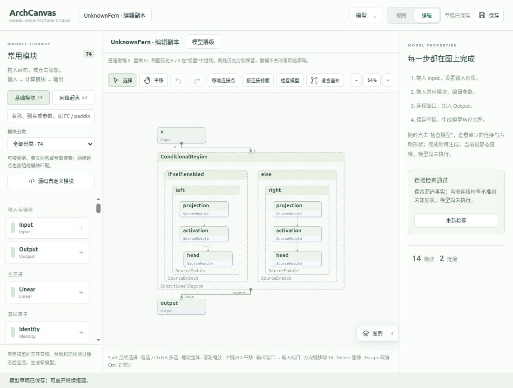

# 未知源码区域的内部依赖箭头修复

本轮修复“未知模块展开后只有卡片、没有内部箭头”，同时修复实际验证发现的编辑模式崩溃和正式导出失败。实现依据源码结构，适用于未注册在预设目录中的模型名称。

## 原因与实现

原来的源码查看项带有模块、分支和调用表达式，却没有独立的关系事实；渲染器只绘制经过语义恢复的张量绑定。未知配置、循环或外部操作不能安全地补成张量边，因此这些展开区域没有内部箭头。

新增 `architecture.sourceRelations`，从静态 AST 的变量定义与使用恢复依赖，包括嵌套调用、赋值别名、分支内传递和分支汇合，以及实际 `nn.Sequential` 合同中的顺序。每条关系保留源码位置和两端身份。不会因为语句、分支或 `ModuleList` 元素在列表中相邻就直接串线；符号循环仅展示一份模板，不推测循环次数和回边。不导入或执行用户模型。

源码关系与 `architecture.edges` 分开：源码箭头没有张量 ID 和端口绑定，显示为紫色点状虚线，图例注明“源码数据依赖 · 执行路径未确定”。已恢复的张量数据流继续使用原有连线。缺少配置时可以查看源码中的两条路径，但不能据此声称两条路径同时执行、形状已验证或整个模型可生成回写。

视图和编辑模式使用同一正交路由器：根据移动后的几何位置选择连接侧面，遇到阻挡时比较其他侧面。折叠会把关系投影到当前可见祖先，同一容器内部的关系隐藏；重新展开恢复原来的关系身份。源码关系不进入可编辑的张量连线集合，也不会让源码查看项获得虚构端口。图边界、适合画布和详情导出均考虑源码关系。

默认排列根据依赖拓扑确定模块先后；同一条件的备选分支并排显示。编辑模式保留展开边界的原始张量端口并向路由器提供完整层级，修复进入编辑模式时找不到端点导致的崩溃。正式出版 SVG 排除 UI 专用交互属性，出版导出器接纳源码关系标记，修复页面正常但正式导出拒绝新箭头的问题。

## 验证证据

证据目录：[`evidence/source-dependency-arrows-20261010`](evidence/source-dependency-arrows-20261010/)。

| 检查 | 结果 | 证据 |
| --- | --- | --- |
| 完整 Python 回归 | 464 项通过，无跳过；正常退出代码 0 | `backend-exit-verification.log`、`backend-exit-result.json` |
| 完整 Studio 回归 | 596 项通过，无跳过 | `frontend-final.log` |
| 真实出版转换 | 12 项通过，含未知源码箭头的 SVG/PDF/PNG | `publication-final.log` |
| TypeScript 与生产构建 | 通过；保留 Vite 的大包体积提示 | `build-final.log` |
| Skill 指令检查 | 通过 | `skill-validation.log` |
| beta.10 包、完整安装与全局入口核验 | 通过，`releaseIntegrity: verified` | `beta10-*-verification.json`、`beta10-doctor.json` |
| 回滚及恢复新版的独立演练 | beta.10 → beta.8 → beta.10 均核验通过 | `rollback-smoke.json`、`rollback-forward-smoke.json` |

新增测试覆盖嵌套调用、分支隔离/汇合、提前返回、元组同时赋值、Sequential 与 ModuleList 区分、构造出现次数、无模型执行、折叠/恢复、JSON 重开、移动重新布线、详情范围、黑白 SVG、关系预算、张量关系不变和实际出版转换。

一次完整回归已经输出 464 项 `OK`，但工具会话最终报告 143，因此追加了带线程及解释器退出记录的独立完整回归。追加回归 403.001 秒，464 项通过，结束时仅主线程存活、解释器退出处理已到达，工具返回退出代码 0；以上以追加证据确认正常完成。

真实 PatchTST 静态分析恢复 484 个对象（其中 480 个为有界源码查看项），保留 3 条规范张量关系，新增 119 条源码依赖。完全展开约 0.70 秒；编辑副本的张量和源码路由合计约 0.49 秒。视图及编辑副本的源码路线阻挡均为 0，编辑副本的 2 条可见张量路线阻挡也为 0。计时来自本机一次最终验证，不代表浏览器帧率或任意模型性能保证。见 `patchtst-final-summary.json`、`patchtst-final-expanded.svg`。

浏览器使用独立服务和源码名称不在预设目录中的 `UnknownFern` 验证了：进入编辑页显示 14 个对象和 4 条源码箭头；折叠 `left` 后为 2 条、重新展开恢复 4 条；移动 `head` 后箭头路径改变；保存、切回视图、展开、正式保存、重新打开、再次进入编辑页后关系保留。正式服务 SVG 导出包含 4 个源码关系组和对应元数据；见 `unknown-fern-final-export.json`、`unknown-fern-final.svg` 和截图。



## 安装与回滚

全局 Skill `/home/fzg/.codex/skills/archcanvas` 已切换到 **0.1.0-beta.10**，入口与内嵌 `runtime/release` 同版本，完整核验通过。实际安装副本对未知测试模型、真实 PatchTST 的分析事实与开发版本完全一致。

之前全局目录混合了 beta.7 的外层入口与 beta.8 的嵌套发行目录，现已整体保留于 `.archcanvas/backups/global-skill-before-source-arrows-beta10-20261010`，没有丢弃旧文件。正式 host 安装器生成了完整的新版 Skill；不再将通用发行前缀直接安装到 Skill 目录。

最终包为 `.archcanvas/releases/archcanvas-0.1.0-beta.10.tar.gz`，SHA-256：`fd0cc55e90d4e0c8e527f7d14e66ad8ab7b354a905bf6b30a21994c6498be6a2`。beta.9 是导出遗漏修复前的保留候选，未激活。历史发行包未覆盖。

已独立核验的完整 beta.8 回滚副本保存在 `.archcanvas/source-arrows-beta8-rollback/.agents/skills/archcanvas`。执行：

```bash
bash scripts/rollback_source_arrows_20261010.sh
```

该脚本只切换全局 Skill，保留被替换版本；不回退开发工作树、不修改模型源码、不删除画布历史。完整回滚及重新启用新版已在隔离目录演练。原本混合安装的字节备份另行保留。

## 实际边界

- 旧画布绑定不可变分析事实，不会自动获得新增关系。重新分析到新文档才能取得箭头；旧画布及历史保留。正在运行的服务需重新启动才能使用更新的解析代码。
- 源码查看仍限制 480 个新增对象、12 层和 1440 条关系。PatchTST 触达对象预算，诊断明确提示截断；本轮不能宣称全部源码操作已经恢复。
- 未解析的动态调用、外部实现、条件配置和未知形状继续保留边界。源码依赖箭头提高可读性，不建立任意 Python 的执行证明或完整语义回写合同。
- 本轮验证本机正式运行时、真实浏览器交互和出版导出；三个宿主的完整客户端认证及论文人工验收仍未完成。
